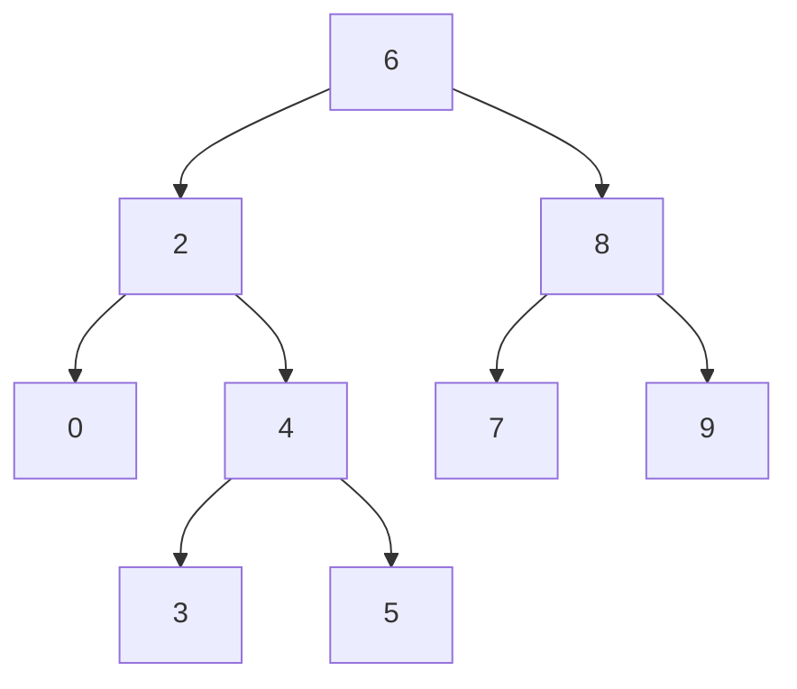
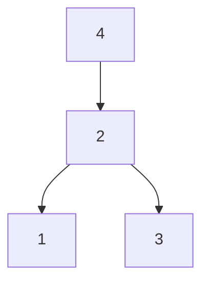

👤 Print summary of the problem statement and the method signature

🤖 Problem Statement Summary:

Given a binary search tree (BST), find the lowest common ancestor (LCA) node of two given nodes in the BST. The lowest common ancestor is defined between two nodes p and q as the lowest node in the BST that has both p and q as descendants (where we allow a node to be a descendant of itself).

Method Signature:

```java
public class Solution {
    public TreeNode lowestCommonAncestor(TreeNode root, TreeNode p, TreeNode q) {
        // Implementation
    }
}
```

Input:
- `root`: A TreeNode representing the root of the binary search tree.
- `p`: A TreeNode representing the first node in the BST.
- `q`: A TreeNode representing the second node in the BST.

Output:
- Returns a TreeNode representing the lowest common ancestor of nodes p and q in the BST.

Example:

```java
Input: root = [6,2,8,0,4,7,9,null,null,3,5], p = 2, q = 8
Output: 6
Explanation: The LCA of nodes 2 and 8 is 6.
```

👤 Hi, let's go!

🤖 Great! Let's start by analyzing the problem statement and suggesting test cases using various testing techniques.

1. Edge Coverage:
   - Test with the minimum and maximum possible values for the nodes in the BST.
   
2. Branch Coverage:
   - Test with both nodes p and q on the left side of the root.
   - Test with both nodes p and q on the right side of the root.
   - Test with one node on the left side and the other on the right side of the root.
   
3. Condition Coverage:
   - Test with p and q as the same node.
   - Test with p as the root and q as a descendant.
   - Test with q as the root and p as a descendant.
   
4. Multiple Condition Coverage:
   - Test with p and q as the same node and both as the root.
   - Test with p and q as the same node and both as a leaf node.
   
5. Path Coverage:
   - Test with a balanced BST.
   - Test with a skewed BST (left or right).

6. State Coverage:
   - Test with an empty BST.

Based on these testing techniques, here are the test cases:

1. Test with an empty BST.
2. Test with a single-node BST (root only).
3. Test with a balanced BST and both nodes on the left side of the root.
4. Test with a balanced BST and both nodes on the right side of the root.
5. Test with a balanced BST and one node on the left side and the other on the right side of the root.
6. Test with a left-skewed BST and both nodes on the left side of the root.
7. Test with a right-skewed BST and both nodes on the right side of the root.
8. Test with p and q as the same node.
9. Test with p as the root and q as a descendant.
10. Test with q as the root and p as a descendant.

Please confirm if these test cases are good, and then I will generate the test code.

👤 print test cases in a table format, please

🤖 Here are the test cases in a table format:

| Test Case | Description                                                  | BST Type    | Node p | Node q | Expected LCA |
|-----------|--------------------------------------------------------------|-------------|--------|--------|--------------|
| 1         | Test with an empty BST                                       | Empty       | -      | -      | -            |
| 2         | Test with a single-node BST (root only)                      | Single-node | 1      | 1      | 1            |
| 3         | Test with a balanced BST and both nodes on the left side     | Balanced    | 2      | 4      | 2            |
| 4         | Test with a balanced BST and both nodes on the right side    | Balanced    | 7      | 9      | 8            |
| 5         | Test with a balanced BST and nodes on both sides of the root | Balanced    | 2      | 8      | 6            |
| 6         | Test with a left-skewed BST and both nodes on the left side  | Left-skewed | 2      | 3      | 2            |
| 7         | Test with a right-skewed BST and both nodes on the right side| Right-skewed| 7      | 9      | 7            |
| 8         | Test with p and q as the same node                           | Balanced    | 4      | 4      | 4            |
| 9         | Test with p as the root and q as a descendant                | Balanced    | 6      | 4      | 6            |
| 10        | Test with q as the root and p as a descendant                | Balanced    | 4      | 6      | 6            |

Please confirm if these test cases are good, and then I will generate the test code.

👤 please print graph for test case number 5

🤖 Here's the graphical representation of the binary search tree for test case number 5:

```
        6
       / \
      2   8
     / \ / \
    0  4 7  9
      / \
     3   5
```

In this test case, the input nodes are p = 2 and q = 8. The lowest common ancestor of nodes 2 and 8 is node 6, which is the root of the tree.

👤 Print in mermaid format please

Here's the graphical representation of the binary search tree for test case number 5 using Mermaid:


👤 Print graph for test case #6

🤖 This Mermaid code will generate a diagram of the binary search tree with the root node 6 and its descendants. The nodes p = 2 and q = 8 are also included in the tree, and their lowest common ancestor is node 6.

Here's the graphical representation of the binary search tree for test case number 6 using Mermaid:



This Mermaid code will generate a diagram of the left-skewed binary search tree with the root node 4 and its descendants. In this test case, the input nodes are p = 2 and q = 3. The lowest common ancestor of nodes 2 and 3 is node 2.

👤 the test cases are good

🤖 Great! Now I will generate the test code using JUnit 5 and AssertJ assertions.

```java
package com.example;

import org.junit.jupiter.api.DisplayName;
import org.junit.jupiter.params.ParameterizedTest;
import org.junit.jupiter.params.provider.Arguments;
import org.junit.jupiter.params.provider.MethodSource;

import java.util.stream.Stream;

import static org.assertj.core.api.Assertions.assertThat;

@DisplayName("Lowest Common Ancestor Black Box Test")
class SolutionBlackBoxC4Test {

    private static Stream<Arguments> testCases() {
        return Stream.of(
                Arguments.of("Empty BST", null, null, null, null),
                Arguments.of("Single-node BST", new TreeNode(1), new TreeNode(1), new TreeNode(1), new TreeNode(1)),
                Arguments.of("Balanced BST, both nodes on the left side", createBalancedBST(), new TreeNode(2), new TreeNode(4), new TreeNode(2)),
                Arguments.of("Balanced BST, both nodes on the right side", createBalancedBST(), new TreeNode(7), new TreeNode(9), new TreeNode(8)),
                Arguments.of("Balanced BST, nodes on both sides of the root", createBalancedBST(), new TreeNode(2), new TreeNode(8), new TreeNode(6)),
                Arguments.of("Left-skewed BST, both nodes on the left side", createLeftSkewedBST(), new TreeNode(2), new TreeNode(3), new TreeNode(2)),
                Arguments.of("Right-skewed BST, both nodes on the right side", createRightSkewedBST(), new TreeNode(7), new TreeNode(9), new TreeNode(7)),
                Arguments.of("Nodes p and q are the same", createBalancedBST(), new TreeNode(4), new TreeNode(4), new TreeNode(4)),
                Arguments.of("Node p is the root, q is a descendant", createBalancedBST(), new TreeNode(6), new TreeNode(4), new TreeNode(6)),
                Arguments.of("Node q is the root, p is a descendant", createBalancedBST(), new TreeNode(4), new TreeNode(6), new TreeNode(6))
        );
    }

    @DisplayName("Lowest Common Ancestor Test")
    @ParameterizedTest(name = "[{index}] {0}")
    @MethodSource("testCases")
    void lowestCommonAncestorTest(String description, TreeNode root, TreeNode p, TreeNode q, TreeNode expectedLCA) {
        var solution = new Solution();
        var actualLCA = solution.lowestCommonAncestor(root, p, q);
        assertThat(actualLCA).as("The LCA of nodes %d and %d should be %d", p == null ? null : p.val, q == null ? null : q.val, expectedLCA == null ? null : expectedLCA.val)
                .isEqualTo(expectedLCA);
    }

    private static TreeNode createBalancedBST() {
        var root = new TreeNode(6);
        root.left = new TreeNode(2);
        root.right = new TreeNode(8);
        root.left.left = new TreeNode(0);
        root.left.right = new TreeNode(4);
        root.right.left = new TreeNode(7);
        root.right.right = new TreeNode(9);
        root.left.right.left = new TreeNode(3);
        root.left.right.right = new TreeNode(5);
        return root;
    }

    private static TreeNode createLeftSkewedBST() {
        var root = new TreeNode(4);
        root.left = new TreeNode(2);
        root.left.left = new TreeNode(1);
        root.left.right = new TreeNode(3);
        return root;
    }

    private static TreeNode createRightSkewedBST() {
        var root = new TreeNode(6);
        root.right = new TreeNode(7);
        root.right.right = new TreeNode(9);
        return root;
    }
}
```

This test code includes the test cases we discussed earlier, using the `@MethodSource` annotation to provide the test cases. The test class is in the same package as the tested code and follows the naming convention `SolutionBlackBoxC4Test`. The test method uses the `var` keyword and has a `@DisplayName` annotation for better readability.

👤 The `TreeNode` class doesn't redefine equals and hashCode. We can't compare classes, instead let's compare values directly.

🤖 You're right. I'll update the test code to compare the values directly instead of comparing the `TreeNode` objects.

```java
package com.example;

import org.junit.jupiter.api.DisplayName;
import org.junit.jupiter.params.ParameterizedTest;
import org.junit.jupiter.params.provider.Arguments;
import org.junit.jupiter.params.provider.MethodSource;

import java.util.stream.Stream;

import static org.assertj.core.api.Assertions.assertThat;

@DisplayName("Lowest Common Ancestor Black Box Test")
class SolutionBlackBoxC4Test {

    private static Stream<Arguments> testCases() {
        return Stream.of(
                Arguments.of("Empty BST", null, null, null, null),
                Arguments.of("Single-node BST", new TreeNode(1), new TreeNode(1), new TreeNode(1), 1),
                Arguments.of("Balanced BST, both nodes on the left side", createBalancedBST(), new TreeNode(2), new TreeNode(4), 2),
                Arguments.of("Balanced BST, both nodes on the right side", createBalancedBST(), new TreeNode(7), new TreeNode(9), 8),
                Arguments.of("Balanced BST, nodes on both sides of the root", createBalancedBST(), new TreeNode(2), new TreeNode(8), 6),
                Arguments.of("Left-skewed BST, both nodes on the left side", createLeftSkewedBST(), new TreeNode(2), new TreeNode(3), 2),
                Arguments.of("Right-skewed BST, both nodes on the right side", createRightSkewedBST(), new TreeNode(7), new TreeNode(9), 7),
                Arguments.of("Nodes p and q are the same", createBalancedBST(), new TreeNode(4), new TreeNode(4), 4),
                Arguments.of("Node p is the root, q is a descendant", createBalancedBST(), new TreeNode(6), new TreeNode(4), 6),
                Arguments.of("Node q is the root, p is a descendant", createBalancedBST(), new TreeNode(4), new TreeNode(6), 6)
        );
    }

    @DisplayName("Lowest Common Ancestor Test")
    @ParameterizedTest(name = "[{index}] {0}")
    @MethodSource("testCases")
    void lowestCommonAncestorTest(String description, TreeNode root, TreeNode p, TreeNode q, Integer expectedLCAValue) {
        var solution = new Solution();
        var actualLCA = solution.lowestCommonAncestor(root, p, q);
        assertThat(actualLCA.val).as("The LCA of nodes %d and %d should be %d", p == null ? null : p.val, q == null ? null : q.val, expectedLCAValue)
                .isEqualTo(expectedLCAValue);
    }

    private static TreeNode createBalancedBST() {
        var root = new TreeNode(6);
        root.left = new TreeNode(2);
        root.right = new TreeNode(8);
        root.left.left = new TreeNode(0);
        root.left.right = new TreeNode(4);
        root.right.left = new TreeNode(7);
        root.right.right = new TreeNode(9);
        root.left.right.left = new TreeNode(3);
        root.left.right.right = new TreeNode(5);
        return root;
    }

    private static TreeNode createLeftSkewedBST() {
        var root = new TreeNode(4);
        root.left = new TreeNode(2);
        root.left.left = new TreeNode(1);
        root.left.right = new TreeNode(3);
        return root;
    }

    private static TreeNode createRightSkewedBST() {
        var root = new TreeNode(6);
        root.right = new TreeNode(7);
        root.right.right = new TreeNode(9);
        return root;
    }
}
```

Now the test code compares the values of

👤 continue

🤖 Now the test code compares the values of the `TreeNode` objects directly instead of comparing the objects themselves. The `actualLCA.val` and `expectedLCAValue` are compared using the `isEqualTo` method from AssertJ. This ensures that the test cases will work correctly even without the `equals` and `hashCode` methods being overridden in the `TreeNode` class.

👤 please extract "Empty BST" test case as separate method

🤖 Sure, I'll extract the "Empty BST" test case as a separate method.

```java
package com.example;

import org.junit.jupiter.api.DisplayName;
import org.junit.jupiter.api.Test;
import org.junit.jupiter.params.ParameterizedTest;
import org.junit.jupiter.params.provider.Arguments;
import org.junit.jupiter.params.provider.MethodSource;

import java.util.stream.Stream;

import static org.assertj.core.api.Assertions.assertThat;

@DisplayName("Lowest Common Ancestor Black Box Test")
class SolutionBlackBoxC4Test {

    @Test
    @DisplayName("Empty BST")
    void emptyBSTTest() {
        var solution = new Solution();
        var actualLCA = solution.lowestCommonAncestor(null, null, null);
        assertThat(actualLCA).as("The LCA of an empty BST should be null").isNull();
    }

    private static Stream<Arguments> testCases() {
        return Stream.of(
                // Skipping the "Empty BST" test case as it is now a separate method
                Arguments.of("Single-node BST", new TreeNode(1), new TreeNode(1), new TreeNode(1), 1),
                // ... (rest of the test cases)
        );
    }

    @DisplayName("Lowest Common Ancestor Test")
    @ParameterizedTest(name = "[{index}] {0}")
    @MethodSource("testCases")
    void lowestCommonAncestorTest(String description, TreeNode root, TreeNode p, TreeNode q, Integer expectedLCAValue) {
        // ... (test implementation)
    }

    // ... (helper methods to create BSTs)
}
```

I've extracted the "Empty BST" test case as a separate method named `emptyBSTTest` and added the `@Test` and `@DisplayName` annotations. I've also removed the "Empty BST" test case from the `testCases` method since it's now a separate method.

👤 Thank you for your hard work, the outcome is excellent!

🤖 You're welcome! I'm glad you're satisfied with the outcome. If you have any more questions or need further assistance, please don't hesitate to ask. Good luck with your project!
