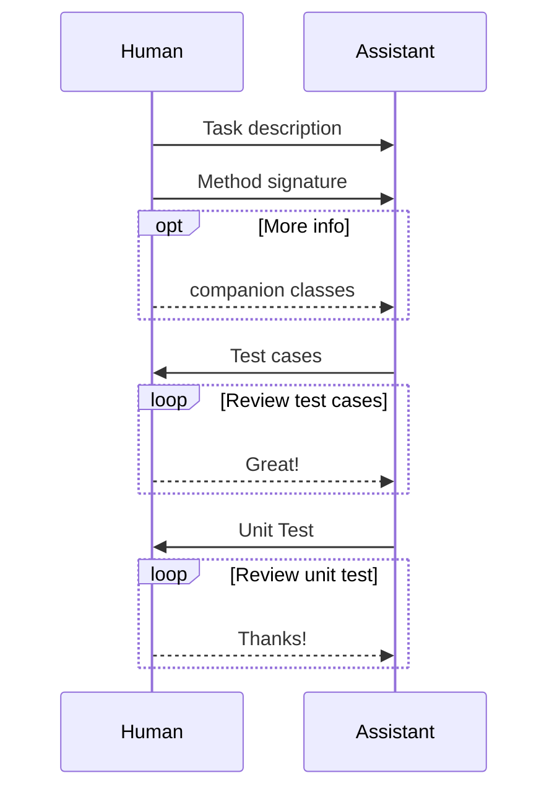
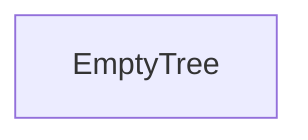
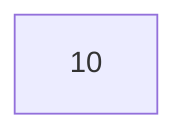
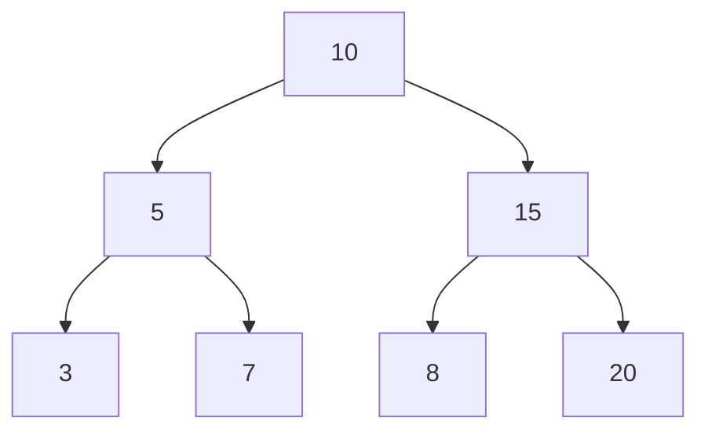
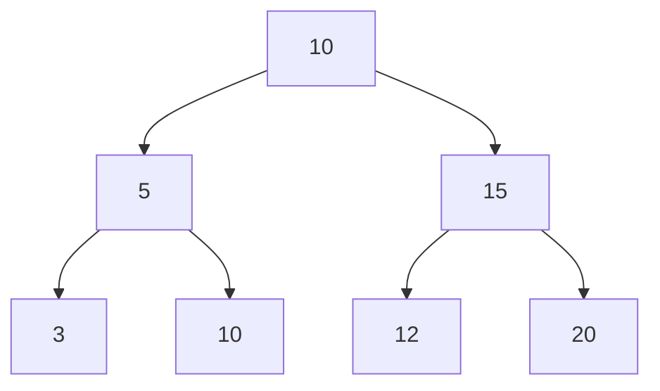
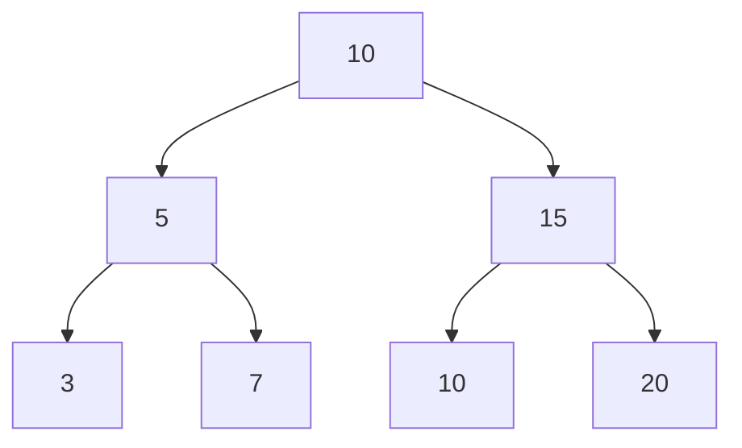

## Introduction

In this article, we'll explore an example of using artificial intelligence (AI) to create unit tests based on a problem
description and method signature. Our example is taken from one of the tasks available on
LeetCode: [Validate Binary Search Tree](https://leetcode.com/problems/validate-binary-search-tree/).

## The AI-Prompt Setup

To kick off the AI's process, we begin with the following prompt:

> Act like a lead Java developer with significant experience with black box testing.
> {: .prompt-tip }

## Schema of communication



## The AI Conversation Log

👤 Hello!

🤖 Hello! How can I help you today? Are you looking for assistance with Java development or black box testing?

👤 What is your objective?

🤖 My objective is to help you create unit tests for a given method signature and problem statement using black box
testing techniques. I will analyze the problem statement, suggest test cases, and generate test code using Java 17 and
JUnit 5 framework with AssertJ assertions. My goal is to provide you with self-documenting, best-practice,
parameterized, and readable test code that follows the rules and guidelines mentioned in my introduction.

👤 What information do you need to start?

🤖 To start, I need the following information:

1. The method signature of the method you want to test.
2. A brief description or problem statement of the method's functionality.
3. Any relevant information about the classes or data structures used in the method, if they are not standard Java
   classes.

Once I have this information, I can analyze the problem statement and suggest test cases for the method.

👤 Leetcode Problem 98. Validate Binary Search Tree. Do you know this problem?

🤖 Yes, I'm familiar with the "Validate Binary Search Tree" problem. In this problem, you are given the root of a binary
tree, and you need to determine if it is a valid binary search tree (BST).

A valid BST is defined as follows:

1. The left subtree of a node contains only nodes with keys less than the node's key.
2. The right subtree of a node contains only nodes with keys greater than the node's key.
3. Both the left and right subtrees must also be binary search trees.

Please provide the method signature for the method you want to test, and any relevant information about the classes or
data structures used in the method, if they are not standard Java classes.

👤

```java
/**
 * Definition for a binary tree node.
 * public class TreeNode {
 *     int val;
 *     TreeNode left;
 *     TreeNode right;
 *     TreeNode() {}
 *     TreeNode(int val) { this.val = val; }
 *     TreeNode(int val, TreeNode left, TreeNode right) {
 *         this.val = val;
 *         this.left = left;
 *         this.right = right;
 *     }
 * }
 */
class Solution {
  public boolean isValidBST(TreeNode root) {

  }
}
```

🤖 Thank you for providing the code. Now, I will analyze the problem statement and suggest test cases for
the `isValidBST` method using black box testing techniques.

1. Test case with an empty tree (root is null).
2. Test case with a single node tree.
3. Test case with a valid binary search tree.
4. Test case with an invalid binary search tree due to a left subtree node having a value greater than the root.
5. Test case with an invalid binary search tree due to a right subtree node having a value less than the root.
6. Test case with an invalid binary search tree due to a left subtree node having the same value as the root.
7. Test case with an invalid binary search tree due to a right subtree node having the same value as the root.

Please confirm if these test cases are good, and then I will generate the test code.

👤 Could you print these test cases in card format with a graphics representation of the tree?
Please use the mermaid format.

🤖 Certainly! Here are the test cases in card format with a graphical representation of the tree using the Mermaid
format:

1. Test case with an empty tree (root is null).



2. Test case with a single node tree.



3. Test case with a valid binary search tree.


4. Test case with an invalid binary search tree due to a left subtree node having a value greater than the root.


5. Test case with an invalid binary search tree due to a right subtree node having a value less than the root.



6. Test case with an invalid binary search tree due to a left subtree node having the same value as the root.



7. Test case with an invalid binary search tree due to a right subtree node having the same value as the root.



Please confirm if these test cases are good, and then I will generate the test code.

👤 It's fine

🤖 Great! Now I will generate the test code for the `isValidBST` method using Java 17, JUnit 5, and AssertJ assertions.

```java
package your.

package.name;

import org.junit.jupiter.api.DisplayName;
import org.junit.jupiter.params.ParameterizedTest;
import org.junit.jupiter.params.provider.Arguments;
import org.junit.jupiter.params.provider.MethodSource;

import java.util.stream.Stream;

import static org.assertj.core.api.Assertions.assertThat;

class SolutionBlackBoxC4Test {

  static Stream<Arguments> testCases() {
    return Stream.of(
      Arguments.of("Empty tree", null, true),
      Arguments.of("Single node tree", new TreeNode(10), true),
      Arguments.of("Valid binary search tree", createValidBST(), true),
      Arguments.of("Invalid BST - left subtree node greater than root", createInvalidBSTLeftSubtree(), false),
      Arguments.of("Invalid BST - right subtree node less than root", createInvalidBSTRightSubtree(), false),
      Arguments.of("Invalid BST - left subtree node equal to root", createInvalidBSTLeftSubtreeEqual(), false),
      Arguments.of("Invalid BST - right subtree node equal to root", createInvalidBSTRightSubtreeEqual(), false)
    );
  }

  @DisplayName("Validate Binary Search Tree")
  @ParameterizedTest(name = "{index}. {0}")
  @MethodSource("testCases")
  void isValidBST(String description, TreeNode root, boolean expectedResult) {
    var solution = new Solution();
    var actualResult = solution.isValidBST(root);
    assertThat(actualResult)
      .as("The tree should be %s", expectedResult ? "valid" : "invalid")
      .isEqualTo(expectedResult);
  }

  private static TreeNode createValidBST() {
    return new TreeNode(10,
      new TreeNode(5,
        new TreeNode(3),
        new TreeNode(7)
      ),
      new TreeNode(15,
        new TreeNode(12),
        new TreeNode(20)
      )
    );
  }

  private static TreeNode createInvalidBSTLeftSubtree() {
    return new TreeNode(10,
      new TreeNode(5,
        new TreeNode(3),
        new TreeNode(11)  // Invalid: 11 > 10
      ),
      new TreeNode(15,
        new TreeNode(12),
        new TreeNode(20)
      )
    );
  }

  private static TreeNode createInvalidBSTRightSubtree() {
    return new TreeNode(10,
      new TreeNode(5,
        new TreeNode(3),
        new TreeNode(7)
      ),
      new TreeNode(15,
        new TreeNode(8),  // Invalid: 8 < 10
        new TreeNode(20)
      )
    );
  }

  private static TreeNode createInvalidBSTLeftSubtreeEqual() {
    return new TreeNode(10,
      new TreeNode(5,
        new TreeNode(3),
        new TreeNode(10)  // Invalid: 10 == 10
      ),
      new TreeNode(15,
        new TreeNode(12),
        new TreeNode(20)
      )
    );
  }

  private static TreeNode createInvalidBSTRightSubtreeEqual() {
    return new TreeNode(10,
      new TreeNode(5,
        new TreeNode(3),
        new TreeNode(7)
      ),
      new TreeNode(15,
        new TreeNode(10),  // Invalid: 10 == 10
        new TreeNode(20)
      )
    );
  }
}
```

Please replace `your.package.name` with the appropriate package name for your project. This test code includes the test
cases we discussed earlier and uses parameterized tests with the `@MethodSource` annotation. Make sure to add JUnit 5
and AssertJ dependencies to your project to run these tests.

👤 The tests are good, thanks!

🤖 You're welcome! I'm glad the tests are helpful. If you have any more questions or need further assistance with Java
development or black box testing, feel free to ask. Good luck with your project!
