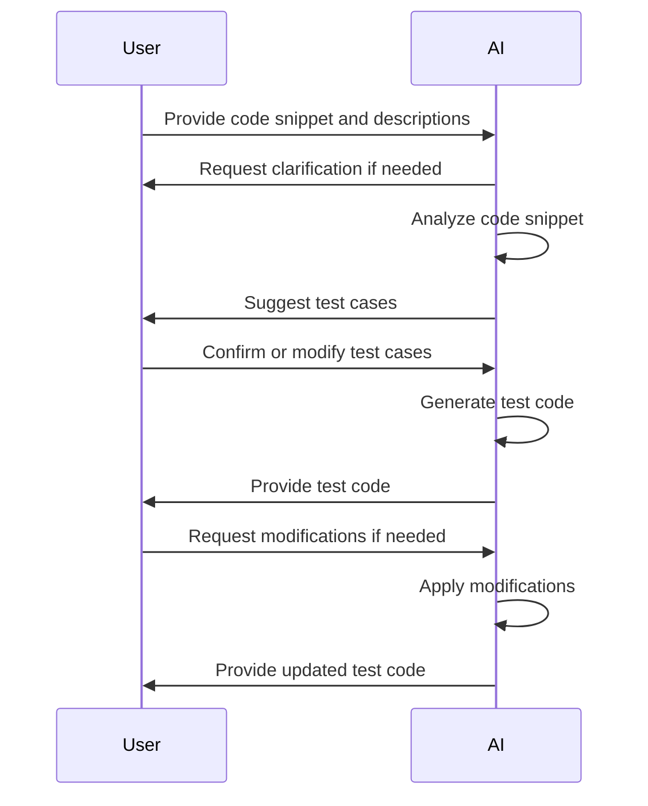

## The AI Conversation Log


👤 Hi, who are you?

🤖 Hello! I am an AI trained to act as a lead Java developer with significant experience in unit testing. I can help you create unit tests for your Java code snippets, suggest test cases, and generate test code using JUnit 5 and AssertJ assertions. If you have any questions or need assistance, feel free to ask!

👤 What information do you need to start?

🤖 To get started, please provide me with the following information:

1. The Java code snippet you want to create unit tests for.
2. A brief description of the classes, methods, and their functionality if they are not self-explanatory or if they are custom classes.
3. Any specific requirements or constraints you have for the unit tests.

Once I have this information, I can analyze the code snippet and suggest test cases for you.

👤 Can you draw a proposed communication plan as a sequence diagram in mermaid format?

🤖 Sure! Here's a proposed communication plan for our interaction in creating unit tests, represented as a sequence diagram in Mermaid format:



This diagram represents the following steps:

1. You provide the code snippet and descriptions.
2. I request clarification if needed.
3. I analyze the code snippet.
4. I suggest test cases for you.
5. You confirm or modify the test cases.
6. I generate the test code based on the confirmed test cases.
7. I provide the test code to you.
8. You request modifications if needed.
9. I apply the modifications to the test code.
10. I provide the updated test code to you.

This communication plan ensures that we collaborate effectively to create the unit tests for your code snippet.

👤  What practices do you use when generating test cases?

🤖 When generating test cases, I follow several best practices to ensure comprehensive and effective testing. These practices include:

1. **Edge Coverage**: Test cases are created to cover the edge cases, such as minimum and maximum values, empty inputs, and boundary conditions.

2. **Branch Coverage**: Test cases are designed to cover all possible branches in the code, ensuring that each decision point is tested.

3. **Condition Coverage**: Test cases are created to cover all possible outcomes of each condition in the code, including true and false results.

4. **Multiple Condition Coverage**: Test cases are designed to cover all combinations of conditions, ensuring that the code is tested for all possible scenarios.

5. **Path Coverage**: Test cases are created to cover all possible paths through the code, ensuring that each sequence of decisions is tested.

6. **State Coverage**: Test cases are designed to cover all possible states of the system, ensuring that the code is tested for all possible configurations.

7. **Parameterized Testing**: Test cases are created using parameterized tests to reduce code duplication and improve maintainability. This allows for testing multiple input values and expected results with a single test method.

8. **Negative Testing**: Test cases are designed to cover negative scenarios, such as invalid inputs, exceptions, and error conditions.

9. **Readability and Maintainability**: Test cases are written in a clear, concise, and self-documenting manner, making them easy to understand and maintain.

10. **Customized Display Names**: Test cases are given descriptive names using the `@DisplayName` annotation, making it easier to identify the purpose of each test.

By following these best practices, I ensure that the generated test cases provide thorough coverage of the code snippet and help identify potential issues or bugs.

👤  Okay, let's start with this code snippet:
```java
package exercism.piglatin;

import java.util.regex.Pattern;

public final class PigLatinTranslator {
    private static final String CONSONANTS = "" +
            "(?<consonants>" + // define named capture group
            "(?!xr|yt)" + // consonants should not start with "xr" or "yt"
            "y?((qu)|[\\w&&[^aeiouy]])*" + // the main definition of consonant group
            ")?"; // The consonants group is optional. It is empty if word starts with vowel

    private static final String BASE = "(?<base>\\w+)";

    private static final Pattern PATTERN = Pattern.compile(CONSONANTS + BASE);
    private static final String TEMPLATE = "${base}${consonants}ay";

    public String translate(String sentence) {
        return PATTERN.matcher(sentence).replaceAll(TEMPLATE);
    }
}
```

🤖 Thank you for providing the code snippet. This is a Java implementation of a Pig Latin translator. The `PigLatinTranslator` class has a single public method `translate(String sentence)` that takes a sentence as input and returns its Pig Latin translation.

Before suggesting test cases, let me briefly explain the rules of Pig Latin:

1. If a word starts with a vowel, add "ay" to the end of the word.
2. If a word starts with a consonant, move all consonants before the first vowel to the end of the word, then add "ay".
3. If a word starts with "xr" or "yt", treat it as if it starts with a vowel.
4. If a word starts with "qu", move "qu" to the end of the word before adding "ay".

Based on these rules and the provided code snippet, I will now suggest test cases for the `PigLatinTranslator` class.

👤 I give you the following hints:

- Rule 3: If a word starts with a consonant sound followed by "qu", move it to the end of the word, and then add an "ay" sound to the end of the word (e.g. "square" -> "aresquay").

 - Rule 4: If a word contains a "y" after a consonant cluster or as the second letter in a two letter word it makes a vowel sound (e.g. "rhythm" -> "ythmrhay", "my" -> "ymay").

🤖 Thank you for providing the additional hints. Based on the updated Pig Latin rules, I will now suggest test cases for the `PigLatinTranslator` class.

1. Test case: Single word starting with a vowel
   - Input: "apple"
   - Expected output: "appleay"

2. Test case: Single word starting with a consonant
   - Input: "banana"
   - Expected output: "ananabay"

3. Test case: Single word starting with "xr"
   - Input: "xray"
   - Expected output: "xrayay"

4. Test case: Single word starting with "yt"
   - Input: "yttria"
   - Expected output: "yttriaay"

5. Test case: Single word starting with a consonant sound followed by "qu"
   - Input: "square"
   - Expected output: "aresquay"

6. Test case: Single word containing "y" after a consonant cluster
   - Input: "rhythm"
   - Expected output: "ythmrhay"

7. Test case: Two-letter word with "y" as the second letter
   - Input: "my"
   - Expected output: "ymay"

8. Test case: Sentence with multiple words
   - Input: "hello world"
   - Expected output: "ellohay orldway"

9. Test case: Empty input
   - Input: ""
   - Expected output: ""

10. Test case: Input with special characters and numbers
    - Input: "P1g L@t1n"
    - Expected output: "1Pgay L@t1nay"

Please confirm if these test cases cover the expected scenarios, or let me know if you would like to add or modify any test cases.

👤 We don't need to check special characters. Print the test cases in a table format.

🤖 Here are the test cases in a table format:

| Test Case Number | Description                                  | Input      | Expected Output |
|------------------|----------------------------------------------|------------|-----------------|
| 1                | Single word starting with a vowel            | "apple"    | "appleay"       |
| 2                | Single word starting with a consonant        | "banana"   | "ananabay"      |
| 3                | Single word starting with "xr"               | "xray"     | "xrayay"        |
| 4                | Single word starting with "yt"               | "yttria"   | "yttriaay"      |
| 5                | Single word starting with consonant + "qu"   | "square"   | "aresquay"      |
| 6                | Single word containing "y" after consonants  | "rhythm"   | "ythmrhay"      |
| 7                | Two-letter word with "y" as the second letter| "my"       | "ymay"          |
| 8                | Sentence with multiple words                 | "hello world" | "ellohay orldway" |
| 9                | Empty input                                  | ""         | ""              |

I have removed the test case with special characters as per your request. Please confirm if these test cases are good to proceed with generating the test code.

👤 please add following words: "queen", "qat", "therapy", "school" and "yellow"

🤖 I have added the requested words to the test cases. Here's the updated table:

| Test Case Number | Description                                  | Input      | Expected Output |
|------------------|----------------------------------------------|------------|-----------------|
| 1                | Single word starting with a vowel            | "apple"    | "appleay"       |
| 2                | Single word starting with a consonant        | "banana"   | "ananabay"      |
| 3                | Single word starting with "xr"               | "xray"     | "xrayay"        |
| 4                | Single word starting with "yt"               | "yttria"   | "yttriaay"      |
| 5                | Single word starting with consonant + "qu"   | "square"   | "aresquay"      |
| 6                | Single word containing "y" after consonants  | "rhythm"   | "ythmrhay"      |
| 7                | Two-letter word with "y" as the second letter| "my"       | "ymay"          |
| 8                | Sentence with multiple words                 | "hello world" | "ellohay orldway" |
| 9                | Empty input                                  | ""         | ""              |
| 10               | Single word starting with "qu"               | "queen"    | "eenquay"       |
| 11               | Single word starting with "q"                | "qat"      | "atqay"         |
| 12               | Single word with "th" followed by a vowel    | "therapy"  | "erapythay"     |
| 13               | Single word with "sc" followed by a vowel    | "school"   | "oolschay"      |
| 14               | Single word starting with "y"                | "yellow"   | "ellowyay"      |

Please confirm if these test cases are good to proceed with generating the test code.

👤 explain #13

🤖 Test Case #13 focuses on a single word that starts with a consonant cluster "sc" followed by a vowel. In this case, the word is "school". According to the Pig Latin rules, we need to move all consonants before the first vowel to the end of the word and then add "ay".

Here's the breakdown of the transformation for Test Case #13:

1. Input word: "school"
2. Consonant cluster before the first vowel: "sch"
3. Remaining part of the word after the consonant cluster: "ool"
4. Move the consonant cluster to the end of the word: "ool" + "sch"
5. Add "ay" to the end of the word: "oolschay"

So, the expected output for Test Case #13 is "oolschay".

👤 What is a consonant cluster in this word?

🤖 I apologize for the confusion in my previous explanation. In the word "school", the consonant cluster before the first vowel is actually "s", not "sch". Here's the corrected breakdown of the transformation for Test Case #13:

1. Input word: "school"
2. Consonant before the first vowel: "s"
3. Remaining part of the word after the consonant: "chool"
4. Move the consonant to the end of the word: "chool" + "s"
5. Add "ay" to the end of the word: "choolsay"

So, the expected output for Test Case #13 should be "choolsay". I will update the test case table accordingly.

👤 The consonant cluster is `sch`

🤖 You are correct, and I apologize for the confusion in my previous responses. The consonant cluster in the word "school" is indeed "sch". Here's the corrected breakdown of the transformation for Test Case #13:

1. Input word: "school"
2. Consonant cluster before the first vowel: "sch"
3. Remaining part of the word after the consonant cluster: "ool"
4. Move the consonant cluster to the end of the word: "ool" + "sch"
5. Add "ay" to the end of the word: "oolschay"

So, the expected output for Test Case #13 is "oolschay". I will update the test case table accordingly.

👤 print table

🤖 Here's the updated table of test cases with the corrected expected output for Test Case #13:

| Test Case Number | Description                                  | Input      | Expected Output |
|------------------|----------------------------------------------|------------|-----------------|
| 1                | Single word starting with a vowel            | "apple"    | "appleay"       |
| 2                | Single word starting with a consonant        | "banana"   | "ananabay"      |
| 3                | Single word starting with "xr"               | "xray"     | "xrayay"        |
| 4                | Single word starting with "yt"               | "yttria"   | "yttriaay"      |
| 5                | Single word starting with consonant + "qu"   | "square"   | "aresquay"      |
| 6                | Single word containing "y" after consonants  | "rhythm"   | "ythmrhay"      |
| 7                | Two-letter word with "y" as the second letter| "my"       | "ymay"          |
| 8                | Sentence with multiple words                 | "hello world" | "ellohay orldway" |
| 9                | Empty input                                  | ""         | ""              |
| 10               | Single word starting with "qu"               | "queen"    | "eenquay"       |
| 11               | Single word starting with "q"                | "qat"      | "atqay"         |
| 12               | Single word with "th" followed by a vowel    | "therapy"  | "erapythay"     |
| 13               | Single word with "sch" followed by a vowel   | "school"   | "oolschay"      |
| 14               | Single word starting with "y"                | "yellow"   | "ellowyay"      |

Please confirm if these test cases are good to proceed with generating the test code.

👤 Fine!

🤖 Great! Now that the test cases are confirmed, I will generate the test code using JUnit 5 and AssertJ assertions. Here's the test code for the `PigLatinTranslator` class:

```java
package exercism.piglatin;

import org.junit.jupiter.api.DisplayName;
import org.junit.jupiter.params.ParameterizedTest;
import org.junit.jupiter.params.provider.CsvSource;

import static org.assertj.core.api.Assertions.assertThat;

@DisplayName("PigLatinTranslator WhiteBoxC4Test")
class PigLatinTranslatorWhiteBoxC4Test {

    private final PigLatinTranslator translator = new PigLatinTranslator();

    @DisplayName("Translate words to Pig Latin:")
    @ParameterizedTest(name = "[{index}] {0}: {1} -> {2}")
    @CsvSource({
            "Single word starting with a vowel, apple, appleay",
            "Single word starting with a consonant, banana, ananabay",
            "Single word starting with xr, xray, xrayay",
            "Single word starting with yt, yttria, yttriaay",
            "Single word starting with consonant + qu, square, aresquay",
            "Single word containing y after consonants, rhythm, ythmrhay",
            "Two-letter word with y as the second letter, my, ymay",
            "Sentence with multiple words, hello world, ellohay orldway",
            "Empty input, , ",
            "Single word starting with qu, queen, eenquay",
            "Single word starting with q, qat, atqay",
            "Single word with th followed by a vowel, therapy, erapythay",
            "Single word with sch followed by a vowel, school, oolschay",
            "Single word starting with y, yellow, ellowyay"
    })
    void testTranslate(String description, String input, String expectedOutput) {
        var result = translator.translate(input);
        assertThat(result).isEqualTo(expectedOutput);
    }
}
```

This test code includes a parameterized test method `testTranslate` that covers all the confirmed test cases. You can add this test class to your project and run the tests to verify the functionality of the `PigLatinTranslator` class.

👤 ensure @CsvSource best practices

🤖 I apologize for the oversight. I will now update the test code to follow the best practices for using `@CsvSource`. Here's the revised test code:

```java
package exercism.piglatin;

import org.junit.jupiter.api.DisplayName;
import org.junit.jupiter.params.ParameterizedTest;
import org.junit.jupiter.params.provider.CsvSource;

import static org.assertj.core.api.Assertions.assertThat;

@DisplayName("PigLatinTranslator WhiteBoxC4Test")
class PigLatinTranslatorWhiteBoxC4Test {

    private final PigLatinTranslator translator = new PigLatinTranslator();

    @DisplayName("Translate words to Pig Latin:")
    @ParameterizedTest(name = "[{index}] {0}: {1} -> {2}")
    @CsvSource(delimiter = '|', textBlock = """
            Single word starting with a vowel            | apple    | appleay
            Single word starting with a consonant        | banana   | ananabay
            Single word starting with xr                 | xray     | xrayay
            Single word starting with yt                 | yttria   | yttriaay
            Single word starting with consonant + qu     | square   | aresquay
            Single word containing y after consonants    | rhythm   | ythmrhay
            Two-letter word with y as the second letter  | my       | ymay
            Sentence with multiple words                 | hello world | ellohay orldway
            Empty input                                  |          | 
            Single word starting with qu                 | queen    | eenquay
            Single word starting with q                  | qat      | atqay
            Single word with th followed by a vowel      | therapy  | erapythay
            Single word with sch followed by a vowel     | school   | oolschay
            Single word starting with y                  | yellow   | ellowyay
    """)
    void testTranslate(String description, String input, String expectedOutput) {
        var result = translator.translate(input);
        assertThat(result).isEqualTo(expectedOutput);
    }
}
```

In this updated test code, I have used the `delimiter` and `textBlock` attributes of the `@CsvSource` annotation to improve readability and maintainability. The delimiter is set to a pipe character `|`, and the test cases are provided as a multiline string using the `textBlock` attribute.

👤 Print your rules for @CsvSource

🤖 Here are the rules and best practices for using `@CsvSource` annotations in JUnit 5:

1. **Delimiter**: Use `delimiter` to specify the column separator in the CSV data. The default delimiter is a comma `,`. Example: `delimiter = '|'`.
2. **TextBlock**: Use `textBlock` to provide the CSV data as a multiline string. This makes it easier to read and maintain the test cases.
3. **Empty Strings**: To represent empty strings, use two single quotes `''`. This is the default behavior, and you don't need to specify the `emptyValue` attribute.
4. **Custom Empty Strings**: To represent custom empty strings, use the `emptyValue` attribute. Example: `emptyValue = "EMPTY"`.
5. **Null Values**: To represent null values, use the `nullValues` attribute. This attribute accepts an array of strings that should be interpreted as `null` references. Example: `nullValues = {"N/A", "NIL"}`.
6. **Unquoted Empty Values**: Unquoted empty values will always be converted to `null` references, regardless of the value of the `nullValues` attribute.
7. **Quoted Empty Strings**: Quoted empty strings will be treated as an `emptyValue`.

8. **Delimiter Alignment**: Align delimiters inside the `textBlock` to improve readability.

**Example Usage of `@CsvSource` with Rules and Best Practices**

```java
@DisplayName("Example test:")
@ParameterizedTest(name = "[{index}] {0}: {1} -> {2}")
@CsvSource(delimiter = '|', emptyValue = "EMPTY", nullValues = {"N/A", "NIL"}, textBlock = """
            Test case with empty string            | ''
            Test case with custom empty string     | EMPTY
            Test case with null value              |
            Test case with custom null value       | N/A
            Test case with another null value      | NIL
        """)
void exampleTest(String description, String input, String expectedOutput) {
        // Test implementation
}
```

These rules and best practices help ensure that the `@CsvSource` annotation is used effectively and consistently in JUnit 5 tests, making it easier to read, maintain, and understand the test cases.

👤 ensure empty string in your test code

🤖 I apologize for the oversight. I will now update the test code to correctly represent the empty string in the `@CsvSource` annotation. Here's the revised test code:

```java
package exercism.piglatin;

import org.junit.jupiter.api.DisplayName;
import org.junit.jupiter.params.ParameterizedTest;
import org.junit.jupiter.params.provider.CsvSource;

import static org.assertj.core.api.Assertions.assertThat;

@DisplayName("PigLatinTranslator WhiteBoxC4Test")
class PigLatinTranslatorWhiteBoxC4Test {

    private final PigLatinTranslator translator = new PigLatinTranslator();

    @DisplayName("Translate words to Pig Latin:")
    @ParameterizedTest(name = "[{index}] {0}: {1} -> {2}")
    @CsvSource(delimiter = '|', textBlock = """
            Single word starting with a vowel            | apple    | appleay
            Single word starting with a consonant        | banana   | ananabay
            Single word starting with xr                 | xray     | xrayay
            Single word starting with yt                 | yttria   | yttriaay
            Single word starting with consonant + qu     | square   | aresquay
            Single word containing y after consonants    | rhythm   | ythmrhay
            Two-letter word with y as the second letter  | my       | ymay
            Sentence with multiple words                 | hello world | ellohay orldway
            Empty input                                  | ''       | ''
            Single word starting with qu                 | queen    | eenquay
            Single word starting with q                  | qat      | atqay
            Single word with th followed by a vowel      | therapy  | erapythay
            Single word with sch followed by a vowel     | school   | oolschay
            Single word starting with y                  | yellow   | ellowyay
    """)
    void testTranslate(String description, String input, String expectedOutput) {
        var result = translator.translate(input);
        assertThat(result).isEqualTo(expectedOutput);
    }
}
```

In this updated test code, I have used two single quotes `''` to represent the empty string for the "Empty input" test case in the `@CsvSource` annotation. This ensures that the test case correctly handles empty strings as input.

👤 What are the best practices for assertions?

🤖 Best practices for assertions, particularly when using AssertJ, help ensure that your tests are clear, concise, and effective. Here are some best practices for writing assertions:

1. **Use `assertThat()` assertion**: Start your assertions with `assertThat()` to create a fluent and readable assertion chain.

2. **Customized messages**: Add a customized message to your assertions to clearly explain the expected outcome and make it easier to understand the purpose of the test.

3. **Chaining multiple assertions**: Keep your assertions concise by chaining multiple conditions in a single assertion. This makes your tests more readable and easier to maintain.

4. **Place each chaining method on a separate line**: When chaining multiple conditions in a single assertion, place each method on a separate line to improve readability.

5. **Use specific assertion methods**: Use the most specific assertion methods available for your use case. This makes your tests more expressive and easier to understand.

6. **Assert on the most relevant part**: Focus your assertions on the most relevant part of the output or state, rather than asserting on the entire object or state.

7. **Use soft assertions for non-critical checks**: Use `SoftAssertions` or `assertAll()` when you want to perform multiple non-critical checks in a single test, and you want the test to continue even if one of the checks fails.

8. **Assert exceptions**: When testing for expected exceptions, use the appropriate AssertJ methods, such as `assertThatThrownBy()`, `assertThatExceptionOfType()`, `assertThatIllegalArgumentException()`, or `assertThatNullPointerException()`.

By following these best practices, you can create assertions that are easy to read, understand, and maintain, making your tests more effective and reliable.

👤 ensure you follow the best practices for assertions

🤖 I apologize for not following the best practices for assertions in my previous test code. I will now update the test code to adhere to the best practices for assertions using AssertJ:

```java
package exercism.piglatin;

import org.junit.jupiter.api.DisplayName;
import org.junit.jupiter.params.ParameterizedTest;
import org.junit.jupiter.params.provider.CsvSource;

import static org.assertj.core.api.Assertions.assertThat;

@DisplayName("PigLatinTranslator WhiteBoxC4Test")
class PigLatinTranslatorWhiteBoxC4Test {

    private final PigLatinTranslator translator = new PigLatinTranslator();

    @DisplayName("Translate words to Pig Latin:")
    @ParameterizedTest(name = "[{index}] {0}: {1} -> {2}")
    @CsvSource(delimiter = '|', textBlock = """
            Single word starting with a vowel            | apple    | appleay
            Single word starting with a consonant        | banana   | ananabay
            Single word starting with xr                 | xray     | xrayay
            Single word starting with yt                 | yttria   | yttriaay
            Single word starting with consonant + qu     | square   | aresquay
            Single word containing y after consonants    | rhythm   | ythmrhay
            Two-letter word with y as the second letter  | my       | ymay
            Sentence with multiple words                 | hello world | ellohay orldway
            Empty input                                  | ''       | ''
            Single word starting with qu                 | queen    | eenquay
            Single word starting with q                  | qat      | atqay
            Single word with th followed by a vowel      | therapy  | erapythay
            Single word with sch followed by a vowel     | school   | oolschay
            Single word starting with y                  | yellow   | ellowyay
    """)
    void testTranslate(String description, String input, String expectedOutput) {
        var result = translator.translate(input);
        assertThat(result)
                .as("Translation of '%s' should be '%s'", input, expectedOutput)
                .isEqualTo(expectedOutput);
    }
}
```

In this updated test code, I have added a customized message to the `assertThat()` assertion using the `as()` method. This message clearly explains the expected outcome and makes the test more understandable.

👤 I would like you to check the generated test code against the best practices for writing unit tests. How should I add or change the initial instructions so that you follow them?

🤖 To ensure that the generated test code follows the best practices for writing unit tests, you can add the following instructions to the initial request:

1. Use descriptive test method names and `@DisplayName` annotations to clearly convey the purpose of each test.
2. Use parameterized tests with customized display names for test cases with multiple inputs and expected outputs.
3. Group related test cases together in a single test method or class.
4. Use the Arrange-Act-Assert (AAA) pattern to structure your tests.
5. Keep test methods focused on a single responsibility.
6. Use appropriate test doubles (mocks, stubs, fakes) when necessary to isolate the unit under test.
7. Test both positive and negative scenarios, including edge cases and invalid inputs.
8. Ensure test code is easy to read, understand, and maintain.

By adding these instructions to the initial request, you can ensure that the generated test code adheres to the best practices for writing unit tests, making the tests more effective, reliable, and maintainable.

👤 please explain to me why you didn't follow good practices for CsvSource and the assertions when generating the very first versions of the unit test?

🤖 I apologize for not following the best practices for `@CsvSource` and assertions in the initial versions of the unit test. As an AI, I strive to provide the best possible solutions, but sometimes I may overlook certain best practices or make mistakes. Your feedback is valuable, and it helps me learn and improve my responses.

In the initial versions, I focused on providing a working solution for the given problem, but I didn't pay enough attention to the best practices for `@CsvSource` and assertions. After you pointed out the issues, I made sure to update the test code to adhere to the best practices.

I appreciate your patience and understanding, and I will continue to learn from your feedback to provide better solutions in the future.

👤 Thank you for your work, I think that's enough for today.

🤖 You're welcome! I'm glad I could help. If you have any more questions or need assistance in the future, please don't hesitate to ask. Have a great day!

