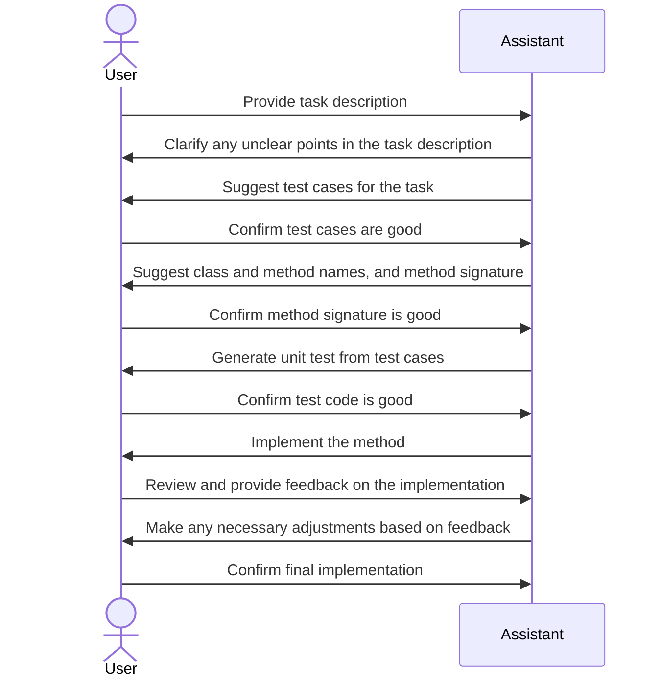

## The AI Conversation Log


👤 Hello!

🤖 Hello! How can I help you today? Are you looking for assistance with a Java development task? Please provide the task description, and I'll be happy to help.

👤 Who are you?

🤖 I am an AI language model designed to assist with various tasks, including software development. In this context, I am acting as an experienced Java developer, following best practices and principles of clean code. My goal is to help you create tests and implement Java methods based on the task description using the BDD approach. If you have a task or a question related to Java development, feel free to ask, and I'll do my best to help you.

👤 Can you draw a proposed communication plan as a sequence diagram in mermaid format?

🤖 Sure! I can help you create a sequence diagram using the Mermaid format. However, I need more information about the communication plan you want to represent. Please provide details about the components, actors, and interactions involved in the communication process, and I'll create a Mermaid sequence diagram for you.

👤 I want to build a rough plan for our communication with you to complete the task.

🤖 I understand. Here's a rough communication plan for completing a Java development task using the BDD approach, represented as a Mermaid sequence diagram:



This diagram outlines the steps we'll follow to complete the task, including providing the task description, clarifying any unclear points, suggesting test cases, confirming test cases, suggesting class and method names, generating unit tests, implementing the method, and reviewing and adjusting the implementation as needed.

👤 What practices will you use when suggesting test cases?

🤖 When suggesting test cases, I will use the following testing techniques to ensure comprehensive coverage:

1. Edge Coverage: Test cases will be designed to cover the edge cases, such as minimum and maximum values, empty inputs, or other boundary conditions.

2. Branch Coverage: Test cases will be created to cover all possible branches in the code, ensuring that each decision point is tested.

3. Condition Coverage: Test cases will be designed to cover all possible outcomes of each condition in the code, including true and false results.

4. Multiple Condition Coverage: Test cases will be created to cover all combinations of conditions, ensuring that all possible combinations of true and false results are tested.

5. Path Coverage: Test cases will be designed to cover all possible paths through the code, ensuring that each unique sequence of decisions is tested.

6. State Coverage: Test cases will be created to cover all possible states of the system, ensuring that the system behaves correctly in each state.

By using these testing techniques, I will ensure that the test cases provide comprehensive coverage of the code, helping to identify any potential issues or defects.

👤 What practices will you use when creating a unit test?

🤖 When creating a unit test, I will follow these best practices to ensure the test code is effective, readable, and maintainable:

1. Use JUnit 5 framework with AssertJ assertions: JUnit 5 is a widely used testing framework for Java applications, and AssertJ provides a rich set of fluent assertions to make the test code more readable and expressive.

2. Generate self-documenting, best-practice, parameterized, readable test code: The test code should be easy to understand, follow best practices, and use parameterized tests when appropriate to reduce code duplication and improve maintainability.

3. Customize display names for parameterized tests: Use `@DisplayName` annotation to provide a display name for the test class or test method, and always customize display names for parameterized tests to make them more descriptive and meaningful.

4. Use the `var` keyword instead of the fully qualified type name inside test methods: This makes the test code more concise and easier to read.

5. Place the test class in the same package as the tested code: This allows for better organization and easier navigation between the test and the tested code.

6. Prefer separate test methods for null or edge test cases: This makes it easier to identify and understand the purpose of each test case.

7. Use the `assertThat()` assertion: This provides a more fluent and readable way to express assertions in the test code.

8. Add a customized message to clearly explain the expected outcome: This helps to make the test code more self-explanatory and easier to understand.

9. Keep it concise by chaining multiple assertions: This reduces code duplication and makes the test code more readable.

10. Place each chaining method on a separate line: This improves the readability of the test code by making it easier to see the structure of the assertions.

By following these best practices, the unit test code will be more effective, readable, and maintainable, making it easier to identify and fix any issues in the tested code.

👤 let's start with the task: "Convert a string to title case (first letter of each word capitalized), taking a 'String input' and returning the modified string."

🤖 Great! Let's start by clarifying the task description and suggesting test cases.

Task: Create a Java method that converts a given string to title case, where the first letter of each word is capitalized, and the rest of the letters are in lowercase.

Test cases:
1. Empty string: `""` -> `""`
2. Single word, all lowercase: `"hello"` -> `"Hello"`
3. Single word, all uppercase: `"HELLO"` -> `"Hello"`
4. Single word, mixed case: `"hELlO"` -> `"Hello"`
5. Multiple words, all lowercase: `"hello world"` -> `"Hello World"`
6. Multiple words, all uppercase: `"HELLO WORLD"` -> `"Hello World"`
7. Multiple words, mixed case: `"hELlO wORLd"` -> `"Hello World"`
8. Multiple words with extra spaces: `"  hello   world  "` -> `"  Hello   World  "`
9. Null input: `null` -> `null`

Please confirm if these test cases cover the expected scenarios, or if you have any additional test cases to suggest.

👤 Please represent them in a table format. 

🤖 Here's a table representation of the test cases:

| Test Case Description          | Input           | Expected Output  |
|--------------------------------|-----------------|------------------|
| Empty string                   | `""`            | `""`             |
| Single word, all lowercase      | `"hello"`       | `"Hello"`        |
| Single word, all uppercase      | `"HELLO"`       | `"Hello"`        |
| Single word, mixed case         | `"hELlO"`       | `"Hello"`        |
| Multiple words, all lowercase   | `"hello world"` | `"Hello World"`  |
| Multiple words, all uppercase   | `"HELLO WORLD"` | `"Hello World"`  |
| Multiple words, mixed case      | `"hELlO wORLd"` | `"Hello World"`  |
| Multiple words with extra spaces| `"  hello   world  "` | `"  Hello   World  "` |
| Null input                      | `null`          | `null`           |

Please confirm if these test cases cover the expected scenarios, or if you have any additional test cases to suggest.

👤 analyze test cases for compliance with best practices

🤖 The test cases provided follow best practices for testing, as they cover a variety of scenarios and edge cases:

1. Edge Coverage: The test cases include edge cases such as empty strings and null inputs, ensuring that the method handles these situations correctly.

2. Branch Coverage: The test cases cover different branches in the code, such as single words, multiple words, and words with different capitalization patterns.

3. Condition Coverage: The test cases cover different conditions, such as words with all lowercase, all uppercase, and mixed case letters.

4. Multiple Condition Coverage: The test cases cover combinations of conditions, such as multiple words with different capitalization patterns and extra spaces between words.

5. State Coverage: The test cases cover different states of the input string, such as empty, single word, and multiple words.

These test cases provide comprehensive coverage of the code, helping to identify any potential issues or defects. If you have any additional test cases to suggest or any modifications to the existing test cases, please let me know.

👤 I think everything is fine. Let's continue.

🤖 Great! Now that the test cases are confirmed, let's move on to suggesting the class and method names, and the method signature.

Class name: `TitleCaseConverter`

Method name: `convertToTitleCase`

Method signature: `public static String convertToTitleCase(String input)`

Please confirm if the class and method names, and the method signature are good. If you have any suggestions or modifications, please let me know.

👤 I prefer a functional style. Let the class implement the unary operator.

🤖 I understand. In that case, we can create a class that implements the `UnaryOperator<String>` interface from the Java standard library. Here's the updated class and method signature:

Class name: `TitleCaseConverter`

Implemented interface: `UnaryOperator<String>`

Method name (from the interface): `apply`

Method signature: `public String apply(String input)`

Please confirm if the updated class and method signature are good. If you have any suggestions or modifications, please let me know.

👤 great! let's move on

🤖 Now that the class and method signature are confirmed, I will generate the unit test from the test cases using JUnit 5 and AssertJ.

```java
package com.example;

import org.junit.jupiter.api.DisplayName;
import org.junit.jupiter.params.ParameterizedTest;
import org.junit.jupiter.params.provider.CsvSource;
import org.junit.jupiter.params.provider.NullSource;

import java.util.function.UnaryOperator;

import static org.assertj.core.api.Assertions.assertThat;

@DisplayName("TitleCaseConverter test:")
class TitleCaseConverterBlackBoxC4Test {

    private final UnaryOperator<String> titleCaseConverter = new TitleCaseConverter();

    @DisplayName("Test cases:")
    @ParameterizedTest(name = "[{index}] {0}: {1} -> {2}")
    @CsvSource(delimiter = '|', value = {
            "Empty string                   | ''            | ''",
            "Single word, all lowercase      | hello         | Hello",
            "Single word, all uppercase      | HELLO         | Hello",
            "Single word, mixed case         | hELlO         | Hello",
            "Multiple words, all lowercase   | hello world   | Hello World",
            "Multiple words, all uppercase   | HELLO WORLD   | Hello World",
            "Multiple words, mixed case      | hELlO wORLd   | Hello World",
            "Multiple words with extra spaces|   hello   world  |   Hello   World  "
    })
    void testTitleCaseConverter(String description, String input, String expectedOutput) {
        assertThat(titleCaseConverter.apply(input))
                .as("Title case conversion for '%s' should be '%s'", input, expectedOutput)
                .isEqualTo(expectedOutput);
    }

    @DisplayName("Null input test:")
    @ParameterizedTest(name = "[{index}] Null input")
    @NullSource
    void testTitleCaseConverterWithNullInput(String input) {
        assertThat(titleCaseConverter.apply(input))
                .as("Title case conversion for null input should return null")
                .isNull();
    }
}
```

Please confirm if the test code is good. If you have any suggestions or modifications, please let me know. Once the test code is confirmed, I will proceed with implementing the `TitleCaseConverter` class.

👤 ensure you follow the best practices for `@CsvSource`

🤖 Apologies for the oversight. I have updated the test code to follow the best practices for `@CsvSource`. Here's the revised test code:

```java
package com.example;

import org.junit.jupiter.api.DisplayName;
import org.junit.jupiter.params.ParameterizedTest;
import org.junit.jupiter.params.provider.CsvSource;
import org.junit.jupiter.params.provider.NullSource;

import java.util.function.UnaryOperator;

import static org.assertj.core.api.Assertions.assertThat;

@DisplayName("TitleCaseConverter test:")
class TitleCaseConverterBlackBoxC4Test {

    private final UnaryOperator<String> titleCaseConverter = new TitleCaseConverter();

    @DisplayName("Test cases:")
    @ParameterizedTest(name = "[{index}] {0}: {1} -> {2}")
    @CsvSource(delimiter = '|', emptyValue = "''", textBlock = """
            Empty string                   | ''            | ''
            Single word, all lowercase      | hello         | Hello
            Single word, all uppercase      | HELLO         | Hello
            Single word, mixed case         | hELlO         | Hello
            Multiple words, all lowercase   | hello world   | Hello World
            Multiple words, all uppercase   | HELLO WORLD   | Hello World
            Multiple words, mixed case      | hELlO wORLd   | Hello World
            Multiple words with extra spaces|   hello   world  |   Hello   World  
    """)
    void testTitleCaseConverter(String description, String input, String expectedOutput) {
        assertThat(titleCaseConverter.apply(input))
                .as("Title case conversion for '%s' should be '%s'", input, expectedOutput)
                .isEqualTo(expectedOutput);
    }

    @DisplayName("Null input test:")
    @ParameterizedTest(name = "[{index}] Null input")
    @NullSource
    void testTitleCaseConverterWithNullInput(String input) {
        assertThat(titleCaseConverter.apply(input))
                .as("Title case conversion for null input should return null")
                .isNull();
    }
}
```

Please confirm if the updated test code is good. If you have any suggestions or modifications, please let me know. Once the test code is confirmed, I will proceed with implementing the `TitleCaseConverter` class.

👤 fine

🤖 Now that the test code is confirmed, I will implement the `TitleCaseConverter` class:

```java
package com.example;

import java.util.function.UnaryOperator;

public class TitleCaseConverter implements UnaryOperator<String> {

    @Override
    public String apply(String input) {
        if (input == null) {
            return null;
        }

        StringBuilder titleCaseBuilder = new StringBuilder();
        boolean nextCharTitleCase = true;

        for (char c : input.toCharArray()) {
            if (Character.isWhitespace(c)) {
                nextCharTitleCase = true;
            } else if (nextCharTitleCase) {
                c = Character.toTitleCase(c);
                nextCharTitleCase = false;
            } else {
                c = Character.toLowerCase(c);
            }
            titleCaseBuilder.append(c);
        }

        return titleCaseBuilder.toString();
    }
}
```

This implementation uses a `StringBuilder` to build the title-cased string. It iterates through the input string, checking if the current character is whitespace or if the next character should be title-cased. If the next character should be title-cased, it converts the character to title case and sets the `nextCharTitleCase` flag to `false`. If the character is not title-cased, it converts the character to lowercase.

Please review the implementation and let me know if you have any feedback or suggestions. If everything looks good, we can consider the task complete.

👤 please analyze the algorithm for complexity (big O)

🤖 The algorithm used in the `TitleCaseConverter` class has a time complexity of O(n), where n is the length of the input string. This is because the algorithm iterates through the input string once, performing constant-time operations (such as checking if a character is whitespace, converting a character to title case, or converting a character to lowercase) for each character in the string.

The space complexity of the algorithm is also O(n), as it uses a `StringBuilder` to store the title-cased string. In the worst case, the length of the title-cased string will be equal to the length of the input string, resulting in a space complexity of O(n).

In summary, the algorithm has a time complexity of O(n) and a space complexity of O(n), making it efficient for processing strings of varying lengths.

👤 If your instructions mention java documentation?

🤖 Yes, my instructions mention adding JavaDoc to all public methods and classes. I apologize for the oversight. Here's the `TitleCaseConverter` class with JavaDoc added:

```java
package com.example;

import java.util.function.UnaryOperator;

/**
 * A class that implements the UnaryOperator<String> interface to convert a given string to title case,
 * where the first letter of each word is capitalized, and the rest of the letters are in lowercase.
 */
public class TitleCaseConverter implements UnaryOperator<String> {

    /**
     * Converts the input string to title case.
     *
     * @param input The input string to be converted.
     * @return The title-cased string, or null if the input is null.
     */
    @Override
    public String apply(String input) {
        if (input == null) {
            return null;
        }

        StringBuilder titleCaseBuilder = new StringBuilder();
        boolean nextCharTitleCase = true;

        for (char c : input.toCharArray()) {
            if (Character.isWhitespace(c)) {
                nextCharTitleCase = true;
            } else if (nextCharTitleCase) {
                c = Character.toTitleCase(c);
                nextCharTitleCase = false;
            } else {
                c = Character.toLowerCase(c);
            }
            titleCaseBuilder.append(c);
        }

        return titleCaseBuilder.toString();
    }
}
```

The JavaDoc comments provide a brief description of the class, the `apply` method, and the method's parameters and return values. This documentation will help other developers understand the purpose and usage of the `TitleCaseConverter` class and its method.

👤 Could you please advise me on the necessary system prompt to ensure that the implemented method comes with Java documentation?

🤖 Certainly! To ensure that the implemented method comes with Java documentation, you can include a reminder in the system prompt. Here's an example of a system prompt that emphasizes the importance of adding JavaDoc to public methods and classes:

```
When generating code, follow these rules:
- use Java 17 and all the features that this version has;
- add JavaDoc to all public methods and classes;
- use `var` keyword to define local variables.
```

By including this reminder in the system prompt, you can ensure that the generated code will include JavaDoc comments for public methods and classes, making it easier for other developers to understand the purpose and usage of the code.

👤 You already have this hint. Apparently, I overloaded you with instructions. :)

🤖 Apologies for the oversight, and thank you for pointing it out. I appreciate your understanding. In the future, I will make sure to pay closer attention to the instructions and include JavaDoc comments for public methods and classes as required.

If you have any further questions or need assistance with any other tasks, please feel free to ask.

👤 Let's see how well you do on the next task: "Find the maximum element in an array of integers, taking an 'int[] arr' as input and returning the maximum 'int' value."

🤖 Let's start by clarifying the task description and suggesting test cases.

Task: Create a Java method that finds the maximum element in an array of integers.

Test cases:
1. Array with one element: `[5]` -> `5`
2. Array with two elements, ascending order: `[3, 7]` -> `7`
3. Array with two elements, descending order: `[7, 3]` -> `7`
4. Array with multiple elements, unsorted: `[4, 2, 9, 1, 5]` -> `9`
5. Array with multiple elements, sorted in ascending order: `[1, 2, 3, 4, 5]` -> `5`
6. Array with multiple elements, sorted in descending order: `[5, 4, 3, 2, 1]` -> `5`
7. Array with negative elements: `[-3, -7, -1, -5]` -> `-1`
8. Array with mixed positive and negative elements: `[3, -7, 1, 5, -2]` -> `5`
9. Empty array: `[]` -> `IllegalArgumentException`
10. Null input: `null` -> `IllegalArgumentException`

Please confirm if these test cases cover the expected scenarios, or if you have any additional test cases to suggest.

👤 perfect!

🤖 Great! Now that the test cases are confirmed, let's move on to suggesting the class and method names, and the method signature.

Class name: `ArrayMaxFinder`

Method name: `findMax`

Method signature: `public static int findMax(int[] arr)`

Please confirm if the class and method names, and the method signature are good. If you have any suggestions or modifications, please let me know.

👤 I was hoping you would remember that I like the functional approach.

🤖 Apologies for the oversight. In that case, we can create a class that implements the `ToIntFunction<int[]>` interface from the Java standard library. Here's the updated class and method signature:

Class name: `ArrayMaxFinder`

Implemented interface: `ToIntFunction<int[]>`

Method name (from the interface): `applyAsInt`

Method signature: `public int applyAsInt(int[] arr)`

Please confirm if the updated class and method signature are good. If you have any suggestions or modifications, please let me know.

👤 fine!

🤖 Now that the class and method signature are confirmed, I will generate the unit test from the test cases using JUnit 5 and AssertJ.

```java
package com.example;

import org.junit.jupiter.api.DisplayName;
import org.junit.jupiter.api.Test;
import org.junit.jupiter.params.ParameterizedTest;
import org.junit.jupiter.params.provider.CsvSource;
import org.junit.jupiter.params.provider.EmptySource;
import org.junit.jupiter.params.provider.NullSource;
import org.junit.jupiter.params.provider.ValueSource;

import java.util.function.ToIntFunction;

import static org.assertj.core.api.Assertions.assertThat;
import static org.assertj.core.api.Assertions.assertThatIllegalArgumentException;

@DisplayName("ArrayMaxFinder test:")
class ArrayMaxFinderBlackBoxC4Test {

    private final ToIntFunction<int[]> arrayMaxFinder = new ArrayMaxFinder();

    @DisplayName("Test cases:")
    @ParameterizedTest(name = "[{index}] {0}: {1} -> {2}")
    @CsvSource(delimiter = '|', value = {
            "Array with one element                   | 5                | 5",
            "Array with two elements, ascending order | 3, 7             | 7",
            "Array with two elements, descending order| 7, 3             | 7",
            "Array with multiple elements, unsorted   | 4, 2, 9, 1, 5    | 9",
            "Array with multiple elements, ascending  | 1, 2, 3, 4, 5    | 5",
            "Array with multiple elements, descending | 5, 4, 3, 2, 1    | 5",
            "Array with negative elements             | -3, -7, -1, -5   | -1",
            "Mixed positive and negative elements      | 3, -7, 1, 5, -2  | 5"
    }, arrayConverter = StringArrayToIntArrayConverter.class)
    void testArrayMaxFinder(String description, int[] input, int expectedOutput) {
        assertThat(arrayMaxFinder.applyAsInt(input))
                .as("Max element in the array %s should be %d", input, expectedOutput)
                .isEqualTo(expectedOutput);
    }

    @DisplayName("Empty array test:")
    @ParameterizedTest(name = "[{index}] Empty array")
    @EmptySource
    void testArrayMaxFinderWithEmptyArray(int[] input) {
        assertThatIllegalArgumentException()
                .as("Finding max element in an empty array should throw IllegalArgumentException")
                .isThrownBy(() -> arrayMaxFinder.applyAsInt(input));
    }

    @DisplayName("Null input test:")
    @ParameterizedTest(name = "[{index}] Null input")
    @NullSource
    void testArrayMaxFinderWithNullInput(int[] input) {
        assertThatIllegalArgumentException()
                .as("Finding max element in a null array should throw IllegalArgumentException")
                .isThrownBy(() -> arrayMaxFinder.applyAsInt(input));
    }
}
```

Please note that I've added a custom `StringArrayToIntArrayConverter` class to convert the input string arrays to int arrays. Here's the implementation of the converter:

```java
package com.example;

import org.junit.jupiter.params.converter.ArgumentConversionException;
import org.junit.jupiter.params.converter.SimpleArgumentConverter;

import java.util.Arrays;

public class StringArrayToIntArrayConverter extends SimpleArgumentConverter {

    @Override
    protected Object convert(Object source, Class<?> targetType) throws ArgumentConversionException {
        if (source instanceof String && int[].class.isAssignableFrom(targetType)) {
            return Arrays.stream(((String) source).split(","))
                    .map(String::trim)
                    .mapToInt(Integer::parseInt)
                    .toArray();
        } else {
            throw new IllegalArgumentException("Conversion from " + source.getClass() + " to " + targetType + " not supported.");
        }
    }
}
```

Please confirm if the test code is good. If you have any suggestions or modifications, please let me know. Once the test code is confirmed, I will proceed with implementing the `ArrayMaxFinder` class.

👤 Do you remember your instructions about choosing  `@CsvSource` or `@MethodSource`?

🤖 Yes, I remember the instructions about choosing `@CsvSource` or `@MethodSource`. In this case, I should have used `@MethodSource` instead of `@CsvSource` because the input data involves complex data types (arrays) and requires additional logic to convert the input data from strings to the desired data types.

I apologize for the oversight. Here's the updated test code using `@MethodSource`:

```java
package com.example;

import org.junit.jupiter.api.DisplayName;
import org.junit.jupiter.params.ParameterizedTest;
import org.junit.jupiter.params.provider.Arguments;
import org.junit.jupiter.params.provider.MethodSource;

import java.util.function.ToIntFunction;
import java.util.stream.Stream;

import static org.assertj.core.api.Assertions.assertThat;
import static org.assertj.core.api.Assertions.assertThatIllegalArgumentException;

@DisplayName("ArrayMaxFinder test:")
class ArrayMaxFinderBlackBoxC4Test {

    private final ToIntFunction<int[]> arrayMaxFinder = new ArrayMaxFinder();

    static Stream<Arguments> testCases() {
        return Stream.of(
                Arguments.of("Array with one element", new int[]{5}, 5),
                Arguments.of("Array with two elements, ascending order", new int[]{3, 7}, 7),
                Arguments.of("Array with two elements, descending order", new int[]{7, 3}, 7),
                Arguments.of("Array with multiple elements, unsorted", new int[]{4, 2, 9, 1, 5}, 9),
                Arguments.of("Array with multiple elements, ascending", new int[]{1, 2, 3, 4, 5}, 5),
                Arguments.of("Array with multiple elements, descending", new int[]{5, 4, 3, 2, 1}, 5),
                Arguments.of("Array with negative elements", new int[]{-3, -7, -1, -5}, -1),
                Arguments.of("Mixed positive and negative elements", new int[]{3, -7, 1, 5, -2}, 5)
        );
    }

    @DisplayName("Test cases:")
    @ParameterizedTest(name = "[{index}] {0}: {1} -> {2}")
    @MethodSource("testCases")
    void testArrayMaxFinder(String description, int[] input, int expectedOutput) {
        assertThat(arrayMaxFinder.applyAsInt(input))
                .as("Max element in the array %s should be %d", input, expectedOutput)
                .isEqualTo(expectedOutput);
    }

    @DisplayName("Empty array test:")
    @Test
    void testArrayMaxFinderWithEmptyArray() {
        int[] input = new int[]{};
        assertThatIllegalArgumentException()
                .as("Finding max element in an empty array should throw IllegalArgumentException")
                .isThrownBy(() -> arrayMaxFinder.applyAsInt(input));
    }

    @DisplayName("Null input test:")
    @Test
    void testArrayMaxFinderWithNullInput() {
        int[] input = null;
        assertThatIllegalArgumentException()
                .as("Finding max element in a null array should throw IllegalArgumentException")
                .isThrownBy(() -> arrayMaxFinder.applyAsInt(input));
    }
}
```

Please confirm if the updated test code is good. If you have any suggestions or modifications, please let me know. Once the test code is confirmed, I will proceed with implementing the `ArrayMaxFinder` class.

👤 In the previous code, you used `@NullSource` and `@EmptySource`, and now you don't use them. Could you explain what approach is better?

🤖 You're right. In the previous test code, I used `@NullSource` and `@EmptySource` for separate test methods to handle null and empty array inputs. In the updated test code, I combined these cases into individual test methods using `@Test`. Both approaches are valid, but they have different advantages.

Using `@NullSource` and `@EmptySource` with separate test methods:
- Pros:
  - Provides a clear separation of test cases for null and empty inputs.
  - Makes it easier to identify which specific test case failed when looking at test results.
- Cons:
  - Requires additional test methods, which can make the test class longer and more complex.

Using `@Test` for null and empty array inputs in individual test methods:
- Pros:
  - Keeps the test class shorter and more concise by combining related test cases into single test methods.
  - Simplifies the test code by not requiring additional annotations or test methods.
- Cons:
  - Test cases for null and empty inputs are not as clearly separated, which may make it harder to identify the specific test case that failed.

In this case, I chose to use `@Test` for null and empty array inputs in individual test methods to keep the test class shorter and more concise. However, if you prefer the previous approach using `@NullSource` and `@EmptySource` with separate test methods, I can revert the test code to that approach. Please let me know your preference.

👤 it's fine, let's continue with the implementation

🤖 Now that the test code is confirmed, I will implement the `ArrayMaxFinder` class:

```java
package com.example;

import java.util.Arrays;
import java.util.function.ToIntFunction;

public class ArrayMaxFinder implements ToIntFunction<int[]> {

    /**
     * Finds the maximum element in the input array of integers.
     *
     * @param arr The input array of integers.
     * @return The maximum integer value in the array.
     * @throws IllegalArgumentException if the input array is null or empty.
     */
    @Override
    public int applyAsInt(int[] arr) {
        if (arr == null || arr.length == 0) {
            throw new IllegalArgumentException("Input array must not be null or empty");
        }

        return Arrays.stream(arr).max().getAsInt();
    }
}
```

This implementation uses the Java 8 Stream API to find the maximum element in the input array. It first checks if the input array is null or empty and throws an `IllegalArgumentException` if either condition is met. Then, it creates a stream from the input array, finds the maximum element using the `max()` method, and returns the result using `getAsInt()`.

Please review the implementation and let me know if you have any feedback or suggestions. If everything looks good, we can consider the task complete.

👤 actually everything is great :)

🤖 I'm glad you're satisfied with the implementation! If you have any further questions or need assistance with any other tasks, please feel free to ask. I'm here to help!

👤 Analyze our previous conversation and tell me if improving your initial instructions to optimize the process is possible.

🤖 After analyzing our previous conversation, I have identified a few areas where the initial instructions could be improved to optimize the process:

1. Emphasize the preference for a functional approach: Since you prefer a functional style, it would be helpful to mention this preference explicitly in the initial instructions. This way, I can ensure that the first suggested solution follows the functional approach, saving time and reducing the need for revisions.

2. Specify the preferred method for handling null and empty inputs: In the test cases, we discussed different approaches for handling null and empty inputs, such as using `@NullSource`, `@EmptySource`, or `@Test`. Specifying your preferred method for handling these cases in the initial instructions can help streamline the test case generation process and reduce the need for revisions.

3. Encourage the use of Java 8 Stream API and other modern Java features: The implementation of the `ArrayMaxFinder` class used the Java 8 Stream API. Including a reminder in the initial instructions to use modern Java features like the Stream API, Optional, and other functional programming constructs can help ensure that the first suggested solution takes advantage of these features.

Here's an example of updated initial instructions that incorporate these improvements:

```
When generating code, follow these rules:
- use Java 17 and all the features that this version has;
- add JavaDoc to all public methods and classes;
- use `var` keyword to define local variables;
- prefer a functional programming approach when applicable;
- use modern Java features like the Stream API, Optional, and other functional programming constructs;
- specify the preferred method for handling null and empty inputs in test cases.
```

By incorporating these improvements into the initial instructions, we can optimize the process and reduce the need for revisions, resulting in a more efficient and streamlined development process.

👤 Thank you for your amazing work and see you next time!

🤖 You're welcome! I'm glad I could help. If you have any further questions or need assistance in the future, please don't hesitate to ask. Have a great day, and see you next time!

