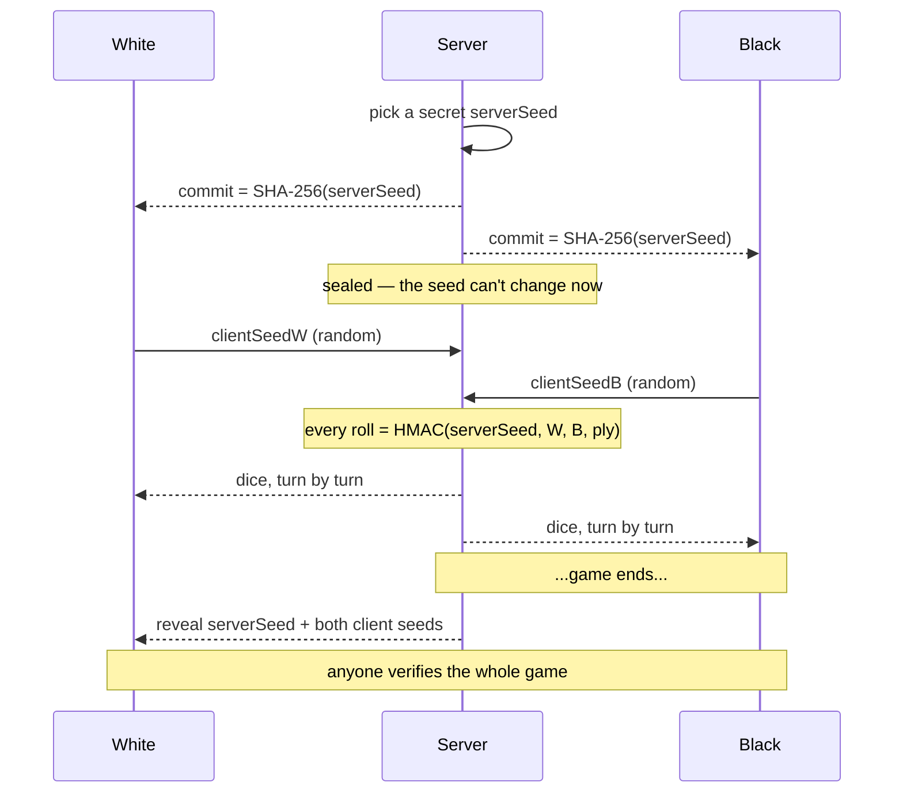

In Dice Chess, the dice *are* the game. You roll, you get a pool of three values, and everything you can do that turn flows from those numbers. So when we moved the platform to a **server-authoritative** model — where the server, not your browser, rolls the dice — an uncomfortable question came with it:

> Why should you trust the server's dice?

A rigged roll is invisible. If the server quietly handed you a worse pool than it should have, you would never know. "Trust us" is not an answer anyone should accept from a game that might one day involve stakes. This post is about how we made the dice **provably fair** — and, more importantly, how *you* can check every single roll yourself.

## Two tempting answers that don't work

The first instinct is to roll on the client. Let the browser generate the dice — then the server can't cheat! Except now *you* can: a patched client just rolls itself a 6 every time. In a head-to-head game, client-side dice are a non-starter.

The second instinct is to keep rolling on the server but promise to behave. That's not verifiable, and unverifiable fairness isn't fairness — it's marketing.

What we actually want is dice that **the server cannot bias and the player cannot grind**, where neither side has to trust the other. That's exactly what a classic cryptographic pattern — **commit-reveal**, with a twist — gives us.

## The idea: a sealed envelope, plus your own dice

Picture the server writing its secret on a card, sealing it in an envelope, and handing you the *sealed* envelope before the game starts. It can't change the card now — you're holding it. But you also don't get to peek yet.

Then both players toss in a pinch of their own randomness. Every roll is computed from the server's secret **and** both players' contributions. At the end of the game, the server opens the envelope, and anyone can replay the math to confirm nothing was tampered with.



The "twist" — the client seeds — is what closes the last loophole. Commit-reveal alone proves the server didn't *change* its seed, but a sneaky server could still have **chosen** a seed it knew would produce favourable rolls. By folding in randomness the players supply *after* the commitment is locked, the server is committing blind: it has no idea what the final dice will be when it seals the envelope.

## How it actually works

Three small pieces of standard cryptography, no blockchain required.

**1. Commit.** At game creation the server generates a 32-byte random `serverSeed` and publishes its hash:

```
commit = SHA-256(serverSeed)
```

You get `commit` immediately — in the create response and on every game snapshot. The server is now locked in.

**2. Contribute & roll.** After the commit, each side submits a high-entropy `clientSeed`. Every roll is then a keyed hash of the server seed over a message built from both client seeds and the turn index (`ply`):

```
roll(ply) = HMAC-SHA256(serverSeed, message)
```

where `message` is the **length-prefixed** concatenation

```
uint32be(len(clientSeedWhite)) ++ clientSeedWhite ++
uint32be(len(clientSeedBlack)) ++ clientSeedBlack ++
int64be(ply)
```

Length-prefixing matters: it means `("a|b", "c")` and `("a", "b|c")` can never collapse into the same message, so the split between the two players' seeds is unambiguous. The hash bytes are turned into three dice in `1..6` by **rejection sampling** — we drop any byte `≥ 252` before taking it mod 6, so all six faces stay exactly equally likely (no modulo bias toward the low numbers).

**3. Reveal.** When the game ends, the final event carries the `serverSeed` and both `clientSeeds`. The envelope is open. Now anyone can check the whole game.

## Verify it yourself

Here's a real game from our production server. At the start, it published this commitment:

```
commit = 7e3ad1923d05b412c56ee52bcc6de5a79f1f21aa5aab4fe41d3fbcd11df2136f
```

When the game ended, it revealed:

```
serverSeed  = 5b4c290e960e3c3a8c4cce633d38b04e136fae6c0e453f5a8dd3b9640157c7c6
clientSeeds = { white: "bot:team:anon:verifier-aa3534dd",
                black: "4c4bda73e3a467f691a6570ee047983b" }
```

Two checks, and you need nothing but a Python standard library:

```python
import hashlib, hmac, struct

SEED   = "5b4c290e960e3c3a8c4cce633d38b04e136fae6c0e453f5a8dd3b9640157c7c6"
COMMIT = "7e3ad1923d05b412c56ee52bcc6de5a79f1f21aa5aab4fe41d3fbcd11df2136f"
WHITE  = "bot:team:anon:verifier-aa3534dd"
BLACK  = "4c4bda73e3a467f691a6570ee047983b"

def roll(server_seed_hex, client_w, client_b, ply):
    seed = bytes.fromhex(server_seed_hex)
    w, b = client_w.encode(), client_b.encode()
    msg = struct.pack(">I", len(w)) + w + struct.pack(">I", len(b)) + b + struct.pack(">q", ply)
    dice, block = [], 0
    while len(dice) < 3:
        h = hmac.new(seed, msg + struct.pack(">i", block), hashlib.sha256).digest()
        for byte in h:
            if len(dice) == 3:
                break
            if byte < 252:                 # reject to avoid modulo bias
                dice.append(byte % 6 + 1)
        block += 1
    return dice

# 1. Does the revealed seed match the commitment?
print("commitment opens:", hashlib.sha256(bytes.fromhex(SEED)).hexdigest() == COMMIT)

# 2. Re-derive the dice for the first few turns.
for ply in range(4):
    print(f"roll(ply={ply}) =", roll(SEED, WHITE, BLACK, ply))
```

Running it prints:

```
commitment opens: True
roll(ply=0) = [6, 3, 1]
roll(ply=1) = [6, 6, 5]
roll(ply=2) = [3, 3, 1]
roll(ply=3) = [1, 4, 6]
```

The first line proves the server revealed the *same* seed it sealed at the start. The rest re-derives the exact dice the game used — compare them against the rolls you saw on the board, and you've audited the entire game end to end. If a single roll didn't match, you'd have caught a cheat.

(You'll notice White's "seed" here is just an identifier rather than random hex. That's the fallback for a seat that didn't submit its own seed in time — more on that next.)

## Why we hold the first roll

There's one subtlety. For the client seeds to actually constrain the server, they have to arrive **after** the commit — otherwise the server could grind its seed against them. So the server **withholds the opening roll** until both seats have submitted a seed.

We didn't want that to ever stall a game, though. So there's a short grace period: if a player hasn't seeded within a few seconds, the game starts anyway, and that seat falls back to a public identifier (which is what you saw above). The committed server seed still makes the dice ungrindable; the only thing a missing seed costs is that seat's own entropy contribution. Games never hang, and the fairness guarantee holds either way.

## What this does — and doesn't — prove

Honesty matters here, because a cryptographic claim that overreaches is worse than none.

What you **can** prove: the server committed to its seed *before* it saw any player's input, never changed it, and produced every roll by the published formula. A biased or buggy operator gets caught — for free, after the fact.

What this **isn't**: a proof that the server seed was generated from good randomness in the first place. The guarantee comes from the *combination* — a commitment made before the client seeds exist, plus entropy the players supply afterwards. That's what makes "the house picked a favourable seed" impossible, even if you don't trust the house's RNG on its own.

## Takeaway

Provably-fair dice turned out to be three humble primitives — a hash, an HMAC, and a pinch of rejection sampling — wired together so that *nobody* has to be trusted. The server can't bias the roll, a patched client can't forge one, and any sceptic with twenty lines of Python can audit a finished game.

If you're building a game with randomness that matters, don't ask your players to trust you. Give them the envelope, let them throw in their own dice, and hand them the math to check your work. Fairness you can verify beats fairness you have to believe in.
