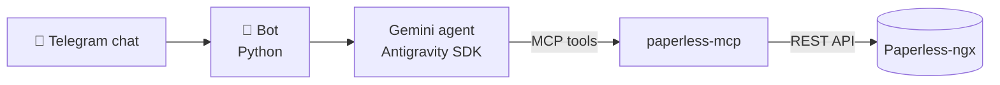

Earlier this year I set up [Paperless-ngx](https://docs.paperless-ngx.com/) in my homelab for our family documents. It is a genuinely excellent piece of software: scan or upload anything, OCR runs automatically, and every contract, invoice, and certificate becomes searchable and tagged. I was happy. My family was not.

Not out of stubbornness. For them the archive was one more web application with one more login to learn, and its search could not answer the questions they actually had — *"when does the apartment insurance expire?"*, *"how much did we spend on utilities this year?"* Keyword search returns documents; my family wanted answers.

So I built them a different interface: a Telegram bot backed by an LLM agent that talks to the archive on each user's behalf. The first working version took about two evenings, assembled from off-the-shelf parts. Turning it into an open-source project I would let strangers run took another two weeks of evenings — and that gap turned out to be the most instructive part. This post is the story of both.

## The problem wasn't the software

Paperless-ngx is built for the person who runs it. The web UI is an archivist's tool — filters, tags, document types, saved views — and for me, the archivist, it is exactly right. My family had no reason to learn any of it: they never file documents, they only ever need something *from* the archive, and rarely more than once a month.

Search was the deeper issue. Paperless-ngx has solid full-text search, and the community mobile apps wrap it in perfectly fine interfaces. But keyword search answers one kind of question: *which documents contain this word*. Family questions are not shaped like that:

- "Is the boiler still under warranty?"
- "What is the notice period in our rental agreement?"
- "Which of us signed the internet contract?"

A search box returns documents, not answers. That is not a flaw — it is what search is. But it means the archive could not answer the questions my family actually had, and no amount of UI polish on top of keyword search was going to change that.

## Meet the users where they already are

Two observations dissolved the problem.

The first: every member of my family already has Telegram open. All day, every day. It is how we talk. An interface that lives there needs no onboarding, no new password, no habit change — the adoption cost is zero.

The second: the missing translation layer between human questions and a REST API finally exists. An LLM agent with tool access can take "how much did we spend on utilities?", decide it needs to search the archive, read the matching invoices, and add up the numbers. Five years ago the chat-bot version of this idea would have been a brittle keyword parser wearing a trench coat. Today it is the boring, obvious architecture.

> The interface everyone already knows, plus a translation layer that finally works.

## Two evenings, three off-the-shelf parts

I wrote very little original code. The bot is mostly plumbing between three components that already existed:

- **[pyTelegramBotAPI](https://github.com/eternnoir/pyTelegramBotAPI)** — the Telegram side: handlers, file uploads, inline buttons.
- **The Gemini API, driven through the Google Antigravity SDK** — the agent loop. I had been [experimenting with Antigravity](/posts/project-environment-optimization-for-google-antigravity-ai-agent/) already, and its agent-with-MCP-tools model fit this exactly.
- **[@baruchiro/paperless-mcp](https://github.com/baruchiro/paperless-mcp)** — a community MCP server that exposes the Paperless-ngx REST API as tools the agent can call.

The one design decision I would defend in front of a security review happened on evening one: **the bot has no permission model of its own**. A small mapping ties each Telegram user ID to that person's own Paperless-ngx API token, and every agent run uses the requesting user's token. Whatever documents Paperless allows that person to see is exactly what the bot can see on their behalf — nothing more. Messages from unknown Telegram IDs are silently ignored. The bot also keeps no database; conversation history lives in memory and dies with the process.

That was the whole first version: ask questions in chat, upload a PDF or photo and have the agent wait out the OCR, then set the title, date, correspondent, and tags itself. Two evenings, most of which went into prompt instructions, not code.

## What it feels like

The part I did not plan for: analytics came free. Because an agent reads the documents it finds, questions a search box cannot parse just… work. And because the bot keeps short per-user conversation memory, so do follow-ups:

> **Me:** How much did we spend on utilities in 2025?
>
> **Bot:** 💶 Utilities in 2025: **€2,140** across 14 invoices — electricity €960, heating €780, water €400.
>
> **Me:** And compared to 2024?
>
> **Bot:** 📈 2024: €1,890 → 2025: €2,140. That's **+13%**, mostly heating.

You can ask in any language, and it answers in the language you used. Found documents come with download buttons for the original PDFs.

{: width="360" }
_Illustrative demo — a mock-up chat with sample data, not a recording of a live instance._

## The honest trade-offs

I shipped this to my own family first and to strangers second, so the limitations were never abstract to me.

**Document text goes to Google.** The agent runs on the Gemini API: retrieved document text and your queries are sent to Google's servers. This is not a fully local setup. A free-tier AI Studio key works, but read the free tier's data-use terms — a paid key comes with different ones. Telegram bot chats are not end-to-end encrypted either.

For our family the extra exposure is close to zero, and it is worth being precise about why. Almost all of these documents arrive by email, and our mailboxes are Gmail: the bills and contracts already live on Google's servers the moment they reach us. We also already forward them to each other in our family chat. Letting a Google API read them to answer a question does not meaningfully change where our data lives. If your documents do not flow through a Google mailbox, your math is different — and if that makes this a dealbreaker, this tool is not for you, yet. Local model support is the obvious future direction if people want it.

**The totals are an assistant's summary, not accounting.** The LLM computes them from the text of the documents it retrieved. Accuracy depends on OCR quality and the model. Treat the numbers as a smart summary and spot-check anything important against the originals — that is what the download buttons are for.

## From "works for us" to something strangers can run

The two-evening version worked, but I would not have published it. Between the working hack and the public repository sat the unglamorous majority of the project: an environment allowlist so the MCP subprocess receives only the variables it needs and never the bot token or other users' credentials; a pinned MCP server version; a real test suite (coverage went from 7% to 65%); CI, static typing, secret scanning; a docs site; and the licensing decisions (AGPL-3.0).

None of that changed what the bot does. All of it changed whether someone else could trust it. The hack is the cheap part — the trust wrapper is where the real cost lives, and I now budget for that whenever I estimate a "small" tool.

## Takeaways

- **The best interface is the one your users already have open.** I could not get my family to adopt a web UI; I never had to ask them to adopt a chat.
- **MCP turned integration into configuration.** I did not write a Paperless client for the agent — I pointed it at an existing community MCP server. The agent-plus-tools pattern generalizes to anything with an API.
- **Don't build a permission model; borrow one.** Per-user API tokens meant the backend's existing permissions did all the security work.
- **Ship the limitations in the same breath as the features.** The "honest part" of the announcement got the warmest replies. Honesty is cheaper than a retraction and reads better than hype.

The project is open source under AGPL-3.0: [github.com/rabestro/paperless-genie](https://github.com/rabestro/paperless-genie), with setup docs at [jc.id.lv/paperless-genie](https://jc.id.lv/paperless-genie/). It is young, and there is a lot of room for improvement — ideas and issues are very welcome.

And if your family also refuses to open the archive's UI: maybe don't fight it. Move the archive to where they already are.
