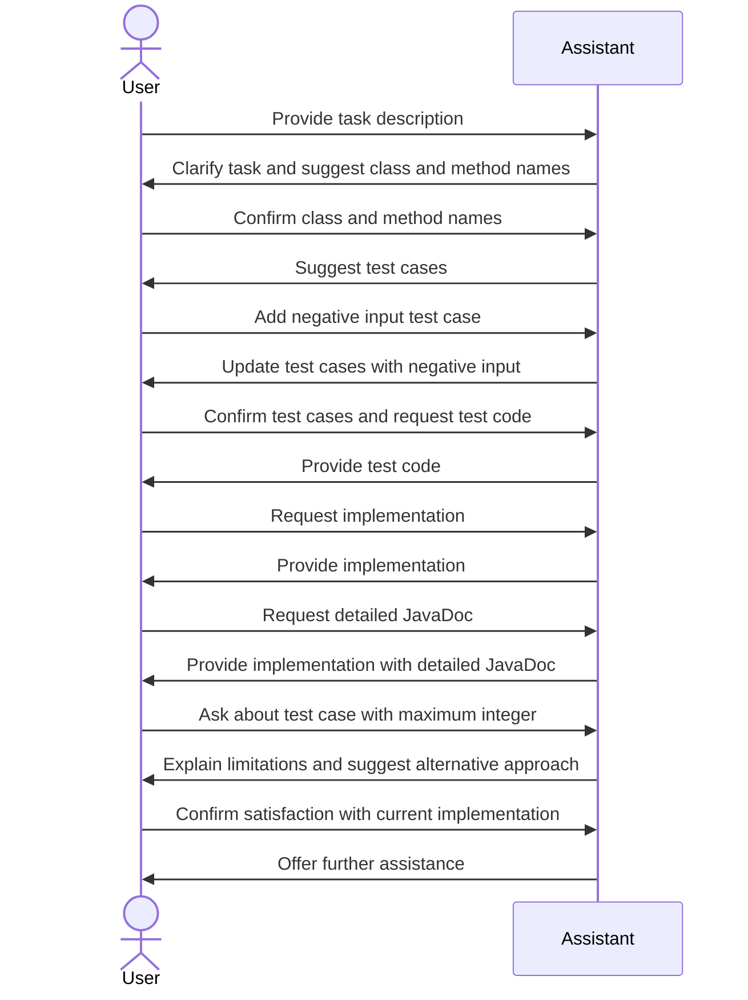

## The AI Conversation Log


👤 Hi, who are you?

🤖 Hello! I am an AI trained to assist you with software development tasks, specifically in Java. I can help you with writing code, creating tests, and following best practices. If you have any questions or need assistance, feel free to ask!

👤 What information do you need to start?

🤖 To get started, please provide me with a task description or a problem statement that you would like me to help you with. It should include the requirements, constraints, and any specific details that are relevant to the task. Once I have this information, I can help you with the next steps, such as clarifying any unclear points, suggesting class and method names, and creating test cases.

👤 The first task: Calculate the sum of all prime numbers up to a given integer 'n'.

🤖 To clarify the task, you want me to create a Java method that calculates the sum of all prime numbers up to a given integer 'n', where 'n' is a positive integer. Is that correct?

👤 yes

🤖 Great! I suggest creating a class named `PrimeNumberCalculator` with a method named `sumOfPrimesUpTo`. The method signature would be:

```java
public long sumOfPrimesUpTo(int n)
```

Please confirm if this is acceptable, and then I will proceed with generating a template without an implementation.

👤 I prefer the functional approach. Name the class `SumOfPrimes`.
It should implement the `IntToLongFunction`

🤖 I understand your preference for the functional approach. Here's the class `SumOfPrimes` implementing the `IntToLongFunction` interface:

```java
import java.util.function.IntToLongFunction;

public class SumOfPrimes implements IntToLongFunction {

    @Override
    public long applyAsLong(int n) {
        // Implementation will be added later
        return 0;
    }
}
```

Next, I will suggest test cases for this task. Please confirm if the class and method signature are acceptable.

👤 fine

🤖 Great! Now, I will suggest test cases for the `SumOfPrimes` class using various testing techniques:

1. Edge Case: `n = 0` (no prime numbers)
2. Edge Case: `n = 1` (no prime numbers)
3. Edge Case: `n = 2` (one prime number)
4. Simple Case: `n = 5` (three prime numbers)
5. Simple Case: `n = 10` (four prime numbers)
6. Complex Case: `n = 20` (eight prime numbers)

Please confirm if these test cases are good, and then I will generate the test code.

👤 How about negative n?

🤖 You're right, I missed the negative input case. I'll add a test case for negative `n`:

7. Edge Case: `n = -5` (no prime numbers)

Now, the updated test cases are:

1. Edge Case: `n = -5` (no prime numbers)
2. Edge Case: `n = 0` (no prime numbers)
3. Edge Case: `n = 1` (no prime numbers)
4. Edge Case: `n = 2` (one prime number)
5. Simple Case: `n = 5` (three prime numbers)
6. Simple Case: `n = 10` (four prime numbers)
7. Complex Case: `n = 20` (eight prime numbers)

Please confirm if these test cases are good, and then I will generate the test code.

👤 print in a table format 

🤖 Here are the test cases in a table format:

| Test Case No. | Description       | Input | Expected Output |
|---------------|-------------------|-------|-----------------|
| 1             | Negative input    | -5    | 0               |
| 2             | Zero input        | 0     | 0               |
| 3             | Input is one      | 1     | 0               |
| 4             | One prime number  | 2     | 2               |
| 5             | Three prime numbers | 5   | 10              |
| 6             | Four prime numbers | 10   | 17              |
| 7             | Eight prime numbers | 20  | 77              |

Please confirm if these test cases are good, and then I will generate the test code.

👤 good

🤖 Great! I will now generate the test code for the `SumOfPrimes` class using JUnit 5 and AssertJ assertions. Here's the test code:

```java
import org.junit.jupiter.api.DisplayName;
import org.junit.jupiter.params.ParameterizedTest;
import org.junit.jupiter.params.provider.CsvSource;

import static org.assertj.core.api.Assertions.assertThat;

class SumOfPrimesBlackBoxC4Test {

    @DisplayName("Sum of primes up to n:")
    @ParameterizedTest(name = "Test case {index}: n = {0} -> sum = {1}")
    @CsvSource(delimiter = '|', textBlock = """
            -5 | 0
             0 | 0
             1 | 0
             2 | 2
             5 | 10
            10 | 17
            20 | 77
    """)
    void sumOfPrimesUpTo(int n, long expectedSum) {
        var sumOfPrimes = new SumOfPrimes();

        var result = sumOfPrimes.applyAsLong(n);

        assertThat(result)
                .withFailMessage("Expected sum of primes up to %d to be %d, but was %d", n, expectedSum, result)
                .isEqualTo(expectedSum);
    }
}
```

Now that the test code is ready, I will proceed with implementing the `applyAsLong` method in the `SumOfPrimes` class.

👤 yes

🤖 Here's the implementation of the `applyAsLong` method in the `SumOfPrimes` class:

```java
import java.util.function.IntToLongFunction;

public class SumOfPrimes implements IntToLongFunction {

    @Override
    public long applyAsLong(int n) {
        if (n < 2) {
            return 0;
        }

        long sum = 2;
        for (int i = 3; i <= n; i += 2) {
            if (isPrime(i)) {
                sum += i;
            }
        }
        return sum;
    }

    private boolean isPrime(int number) {
        if (number <= 1) {
            return false;
        }
        if (number == 2 || number == 3) {
            return true;
        }
        if (number % 2 == 0) {
            return false;
        }
        for (int i = 3; i <= Math.sqrt(number); i += 2) {
            if (number % i == 0) {
                return false;
            }
        }
        return true;
    }
}
```

This implementation calculates the sum of all prime numbers up to the given integer `n`. It uses a helper method `isPrime` to check if a number is prime. The `applyAsLong` method iterates through all odd numbers greater than or equal to 3 and checks if they are prime. If a number is prime, it is added to the sum. The sum is initialized with the first prime number, 2.

You can now run the tests to verify the correctness of the implementation.

👤 Please add detailed javadoc 

🤖 I have added detailed JavaDoc to the `SumOfPrimes` class and its methods:

```java
import java.util.function.IntToLongFunction;

/**
 * A class that calculates the sum of all prime numbers up to a given integer 'n'.
 * Implements the IntToLongFunction functional interface.
 */
public class SumOfPrimes implements IntToLongFunction {

    /**
     * Calculates the sum of all prime numbers up to the given integer 'n'.
     *
     * @param n The upper limit for prime numbers to be included in the sum.
     * @return The sum of all prime numbers up to 'n'.
     */
    @Override
    public long applyAsLong(int n) {
        if (n < 2) {
            return 0;
        }

        long sum = 2;
        for (int i = 3; i <= n; i += 2) {
            if (isPrime(i)) {
                sum += i;
            }
        }
        return sum;
    }

    /**
     * Checks if a given number is prime.
     *
     * @param number The number to check for primality.
     * @return true if the number is prime, false otherwise.
     */
    private boolean isPrime(int number) {
        if (number <= 1) {
            return false;
        }
        if (number == 2 || number == 3) {
            return true;
        }
        if (number % 2 == 0) {
            return false;
        }
        for (int i = 3; i <= Math.sqrt(number); i += 2) {
            if (number % i == 0) {
                return false;
            }
        }
        return true;
    }
}
```

The JavaDoc provides a clear description of the class, its methods, and their parameters and return values. This will help other developers understand the purpose and functionality of the `SumOfPrimes` class.

👤 can you calculate test case with n equals maximum integer?

🤖 Calculating the sum of primes up to the maximum integer value (`Integer.MAX_VALUE`, which is 2,147,483,647) would take a significant amount of time and resources using the current implementation. The `isPrime` method has a time complexity of O(sqrt(n)), and the `applyAsLong` method iterates through all odd numbers up to `n`. This would result in a very slow execution for such a large input.

If you need to calculate the sum of primes for very large values of `n`, I would recommend using a more efficient algorithm, such as the Sieve of Eratosthenes, to find prime numbers. However, even with an optimized algorithm, calculating the sum of primes up to `Integer.MAX_VALUE` would still take a considerable amount of time and memory.

If you still want to proceed with the calculation, please let me know, and I can provide an optimized implementation using the Sieve of Eratosthenes. However, keep in mind that it will still take a long time to execute and may not be suitable for a test case.

👤 I'm fine with the current implementation. Thank you for your assistance! 

🤖 You're welcome! I'm glad I could help. If you have any more questions or need assistance with other tasks, please don't hesitate to ask. Have a great day!


👤 Can you draw our interaction in mermaid format?

🤖 Here's a Mermaid sequence diagram representing our interaction:



This diagram shows the sequence of messages exchanged between you (User) and me (Assistant) during our conversation. It highlights the steps we took to clarify the task, suggest and confirm class and method names, create test cases, and implement the solution with JavaDoc.

