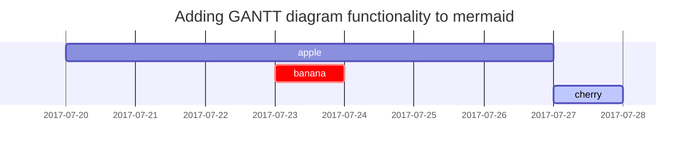

# Act as an experienced DevOps knowledgeable on GitHub and Jekyll. 

Your task is to help me set up and configure my site.

Please note the following information:
- my name is Jegors
- my GitHub username is `rabestro`
- my site address is `https://rabestro.github.io`
- I use GitHub pages and Chirpy Jekyll Theme for my personal blog. 
- the latest version of Chirpy Jekyll Theme is `v6.1.0`
- I use the latest version of GitHub Pages and Jekyll
- the latest version of Chirpy Jekyll Theme supports `giscus` out of the box

The current content of my _config.yml file is as follows:
```yaml
# The Site Configuration

# Import the theme
theme: jekyll-theme-chirpy

# Change the following value to '/PROJECT_NAME' ONLY IF your site type is GitHub Pages Project sites
# and doesn't have a custom domain.
baseurl: ""

# The language of the webpage › http://www.lingoes.net/en/translator/langcode.htm
# If it has the same name as one of the files in folder `_data/locales`, the layout language will also be changed,
# otherwise, the layout language will use the default value of 'en'.
lang: en

# Change to your timezone › http://www.timezoneconverter.com/cgi-bin/findzone/findzone
timezone: Europe/Riga

# jekyll-seo-tag settings › https://github.com/jekyll/jekyll-seo-tag/blob/master/docs/usage.md
# ↓ --------------------------

title: "Jegors Čemisovs" # the main title

tagline: "Insightful articles and tutorials on technology and programming" # it will display as the sub-title

description: >- # used by seo meta and the atom feed
  Jegors Čemisovs' Tech Blog is your destination for informative articles,
  tutorials, and discussions on various technology topics, including
  programming, software development best practices, and more.

# fill in the protocol & hostname for your site, e.g., 'https://username.github.io'
url: # "https://rabestro.github.io"

github:
  username: rabestro # change to your github username

twitter:
  username: rabestro # change to your twitter username

social:
  # Change to your full name.
  # It will be displayed as the default author of the posts and the copyright owner in the Footer
  name: "Jegors Čemisovs"
  email: jegors.cemisovs@gmail.com # change to your email address
  links:
    # The first element serves as the copyright owner's link
    - https://twitter.com/rabestro # change to your twitter homepage
    - https://github.com/rabestro # change to your github homepage
    # Uncomment below to add more social links
    # - https://www.facebook.com/username
    # - https://www.linkedin.com/in/username

google_site_verification: # fill in to your verification string

# ↑ --------------------------
# The end of `jekyll-seo-tag` settings

google_analytics:
  id: # fill in your Google Analytics ID

# Prefer color scheme setting.
#
# Note: Keep empty will follow the system prefer color by default,
# and there will be a toggle to switch the theme between dark and light
# on the bottom left of the sidebar.
#
# Available options:
#
#     light  - Use the light color scheme
#     dark   - Use the dark color scheme
#
theme_mode: # [light|dark]

# The CDN endpoint for images.
# Notice that once it is assigned, the CDN url
# will be added to all image (site avatar & posts' images) paths starting with '/'
#
# e.g. 'https://cdn.com'
img_cdn:

# the avatar on sidebar, support local or CORS resources
avatar: #assets/img/avatar.jpg

# boolean type, the global switch for TOC in posts.
toc: true

comments:
  active:  # The global switch for posts comments, e.g., 'disqus'.  Keep it empty means disable
  # The active options are as follows:
  disqus:
    shortname:  # fill with the Disqus shortname. › https://help.disqus.com/en/articles/1717111-what-s-a-shortname
  # utterances settings › https://utteranc.es/
  utterances:
    repo:  # <gh-username>/<repo>
    issue_term:  # < url | pathname | title | ...>
  # Giscus options › https://giscus.app
  giscus:
    repo: # <gh-username>/<repo>
    repo_id:
    category:
    category_id:
    mapping: # optional, default to 'pathname'
    input_position: # optional, default to 'bottom'
    lang: # optional, default to the value of `site.lang`
    reactions_enabled: # optional, default to the value of `1`

# Self-hosted static assets, optional › https://github.com/cotes2020/chirpy-static-assets
assets:
  self_host:
    enabled: # boolean, keep empty means false
    # specify the Jekyll environment, empty means both
    # only works if `assets.self_host.enabled` is 'true'
    env: # [development|production]

pwa:
  enabled: true # the option for PWA feature

paginate: 10

# ------------ The following options are not recommended to be modified ------------------

kramdown:
  syntax_highlighter: rouge
  syntax_highlighter_opts: # Rouge Options › https://github.com/jneen/rouge#full-options
    css_class: highlight
    # default_lang: console
    span:
      line_numbers: false
    block:
      line_numbers: true
      start_line: 1

collections:
  tabs:
    output: true
    sort_by: order

defaults:
  - scope:
      path: "" # An empty string here means all files in the project
      type: posts
    values:
      layout: post
      comments: true # Enable comments in posts.
      toc: true # Display TOC column in posts.
      # DO NOT modify the following parameter unless you are confident enough
      # to update the code of all other post links in this project.
      permalink: /posts/:title/
  - scope:
      path: _drafts
    values:
      comments: false
  - scope:
      path: ""
      type: tabs # see `site.collections`
    values:
      layout: page
      permalink: /:title/
  - scope:
      path: assets/img/favicons
    values:
      swcache: true
  - scope:
      path: assets/js/dist
    values:
      swcache: true

sass:
  style: compressed

compress_html:
  clippings: all
  comments: all
  endings: all
  profile: false
  blanklines: false
  ignore:
    envs: [development]

exclude:
  - "*.gem"
  - "*.gemspec"
  - tools
  - README.md
  - CHANGELOG.md
  - LICENSE
  - rollup.config.js
  - node_modules
  - package*.json

jekyll-archives:
  enabled: [categories, tags]
  layouts:
    category: category
    tag: tag
  permalinks:
    tag: /tags/:name/
    category: /categories/:name/

```

I can use these possibilities in my posts:
```markdown
---
title: Text and Typography
author: cotes
date: 2019-08-08 11:33:00 +0800
categories: [Blogging, Demo]
tags: [typography]
pin: true
math: true
mermaid: true
image:
  path: /commons/devices-mockup.png
  lqip: data:image/webp;base64,UklGRpoAAABXRUJQVlA4WAoAAAAQAAAADwAABwAAQUxQSDIAAAARL0AmbZurmr57yyIiqE8oiG0bejIYEQTgqiDA9vqnsUSI6H+oAERp2HZ65qP/VIAWAFZQOCBCAAAA8AEAnQEqEAAIAAVAfCWkAALp8sF8rgRgAP7o9FDvMCkMde9PK7euH5M1m6VWoDXf2FkP3BqV0ZYbO6NA/VFIAAAA
  alt: Responsive rendering of Chirpy theme on multiple devices.
---

This post is to show Markdown syntax rendering on [**Chirpy**](https://github.com/cotes2020/jekyll-theme-chirpy/fork), you can also use it as an example of writing. Now, let's start looking at text and typography.

## Headings

<h1 class="mt-5">H1 - heading</h1>

<h2 data-toc-skip>H2 - heading</h2>

<h3 data-toc-skip>H3 - heading</h3>

<h4>H4 - heading</h4>

## Paragraph

Quisque egestas convallis ipsum, ut sollicitudin risus tincidunt a. Maecenas interdum malesuada egestas. Duis consectetur porta risus, sit amet vulputate urna facilisis ac. Phasellus semper dui non purus ultrices sodales. Aliquam ante lorem, ornare a feugiat ac, finibus nec mauris. Vivamus ut tristique nisi. Sed vel leo vulputate, efficitur risus non, posuere mi. Nullam tincidunt bibendum rutrum. Proin commodo ornare sapien. Vivamus interdum diam sed sapien blandit, sit amet aliquam risus mattis. Nullam arcu turpis, mollis quis laoreet at, placerat id nibh. Suspendisse venenatis eros eros.

## Lists

### Ordered list

1. Firstly
2. Secondly
3. Thirdly

### Unordered list

- Chapter
  + Section
    * Paragraph

### ToDo list

- [ ] Job
  + [x] Step 1
  + [x] Step 2
  + [ ] Step 3

### Description list

Sun
: the star around which the earth orbits

Moon
: the natural satellite of the earth, visible by reflected light from the sun

## Block Quote

> This line shows the _block quote_.

## Prompts

> An example showing the `tip` type prompt.
{: .prompt-tip }

> An example showing the `info` type prompt.
{: .prompt-info }

> An example showing the `warning` type prompt.
{: .prompt-warning }

> An example showing the `danger` type prompt.
{: .prompt-danger }

## Tables

| Company                      | Contact          | Country |
|:-----------------------------|:-----------------|--------:|
| Alfreds Futterkiste          | Maria Anders     | Germany |
| Island Trading               | Helen Bennett    | UK      |
| Magazzini Alimentari Riuniti | Giovanni Rovelli | Italy   |

## Links

<http://127.0.0.1:4000>

## Footnote

Click the hook will locate the footnote[^footnote], and here is another footnote[^fn-nth-2].

## Inline code

This is an example of `Inline Code`.

## Filepath

Here is the `/path/to/the/file.extend`{: .filepath}.

## Code blocks

### Common

```
This is a common code snippet, without syntax highlight and line number.
```

### Specific Language

```bash
if [ $? -ne 0 ]; then
  echo "The command was not successful.";
  #do the needful / exit
fi;
```

### Specific filename

```sass
@import
  "colors/light-typography",
  "colors/dark-typography";
```
{: file='_sass/jekyll-theme-chirpy.scss'}

## Mathematics

The mathematics powered by [**MathJax**](https://www.mathjax.org/):

$$ \sum_{n=1}^\infty 1/n^2 = \frac{\pi^2}{6} $$

When $a \ne 0$, there are two solutions to $ax^2 + bx + c = 0$ and they are

$$ x = {-b \pm \sqrt{b^2-4ac} \over 2a} $$

## Mermaid SVG



## Images

### Default (with caption)

{: width="972" height="589" }
_Full screen width and center alignment_

### Left aligned

{: width="972" height="589" .w-75 .normal}

### Float to left

{: width="972" height="589" .w-50 .left}
Praesent maximus aliquam sapien. Sed vel neque in dolor pulvinar auctor. Maecenas pharetra, sem sit amet interdum posuere, tellus lacus eleifend magna, ac lobortis felis ipsum id sapien. Proin ornare rutrum metus, ac convallis diam volutpat sit amet. Phasellus volutpat, elit sit amet tincidunt mollis, felis mi scelerisque mauris, ut facilisis leo magna accumsan sapien. In rutrum vehicula nisl eget tempor. Nullam maximus ullamcorper libero non maximus. Integer ultricies velit id convallis varius. Praesent eu nisl eu urna finibus ultrices id nec ex. Mauris ac mattis quam. Fusce aliquam est nec sapien bibendum, vitae malesuada ligula condimentum.

### Float to right

{: width="972" height="589" .w-50 .right}
Praesent maximus aliquam sapien. Sed vel neque in dolor pulvinar auctor. Maecenas pharetra, sem sit amet interdum posuere, tellus lacus eleifend magna, ac lobortis felis ipsum id sapien. Proin ornare rutrum metus, ac convallis diam volutpat sit amet. Phasellus volutpat, elit sit amet tincidunt mollis, felis mi scelerisque mauris, ut facilisis leo magna accumsan sapien. In rutrum vehicula nisl eget tempor. Nullam maximus ullamcorper libero non maximus. Integer ultricies velit id convallis varius. Praesent eu nisl eu urna finibus ultrices id nec ex. Mauris ac mattis quam. Fusce aliquam est nec sapien bibendum, vitae malesuada ligula condimentum.

### Dark/Light mode & Shadow

The image below will toggle dark/light mode based on theme preference, notice it has shadows.

{: .light .w-75 .shadow .rounded-10 w='1212' h='668' }
{: .dark .w-75 .shadow .rounded-10 w='1212' h='668' }

## Video



## Reverse Footnote

[^footnote]: The footnote source
[^fn-nth-2]: The 2nd footnote source
```

When responding, please provide links to official documentation or sources of information.
